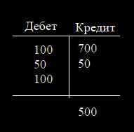

## Рубежный контроль 1

### 1. Принципиальное отличие представления работы предприятий методом финансовой двойной записи от способов, принятых в технике и естественных науках.

Финансовый способ существенно отличается от способов "счета", принятых в технике и естественных науках. Существует два принципиальных отличия:

* имущество и другие ресурсы, находящиеся в распоряжении предприятия, подсчитываются в двух "разрезах": наличия ресурсов по их разновидностям и отношения ресурсов к тому или иному собственнику, в частности, собственникам предприятия и кредиторам;
* не используются отрицательные числа, а их аналогами являются кредитовые остатков счетов-накопителей.

### 2. Необходимость расчёта результатов деятельности предприятий в отношениях с собственниками и кредиторами.

В деятельности предприятий возникает целый ряд проблем, решить которые без привлечения финансового формата практически невозможно. Сформулируем некоторые подобные проблемы.

1. Собственники, как правило, инвестируют свои капиталы с целью их роста. При успешной работе предприятия возникает конфликтный вопрос: какова величина средств, на которые имеют право претендовать собственники в целом и каждый из собственников в отдельности, если их несколько? Вопрос конфликтный, поскольку собственники могли вкладывать свои средства в различной форме (натуральной, денежной) и в различных пропорциях. Кроме того, различны интересы собственников, с одной стороны, и менеджмента предприятия, с другой. Очевидно, собственники претендуют на некую часть результата работы предприятия, и вопрос сводится к тому, что представляет собой этот результат. Аналогичные вопросы возникают в связи с налогообложением предприятий.
2. В попытках ответить на первый вопрос, возникает предположение – нельзя ли считать искомым результатом, например, прирост денежных средств предприятия или прирост общей суммы имущества?
3. В связи с подсчетом результата на некотором временном периоде, например, за год, возникает вопрос – что считать затратами, если приобретенное имущество используется в течение нескольких периодов?
4. Кроме капиталов собственников в предприятие могут вкладываться также и денежные ссуды, и тогда нужно оценивать соблюдение интересов кредиторов (их риски) с учетом возможностей обращения имущества предприятия в деньги, сроков и сумм возврата.

Как видно, ответы на эти вопросы требуют количественного выражения интересов собственников и кредиторов по отношению к имуществу предприятий, что и объясняет необходимость «двойного» счета как собственно имущества, так и прав на него.

### 3. Разновидности активов, пассивов и потоков средств в деятельности предприятий.

Деятельность предприятия изображается в виде сети финансовых счетов, связанных потоками средств, по которым средства движутся от одного счета к другому. Счета являются накопителями, содержимое которых изменяется в результате притоков и оттоков средств.

Часть счетов показывает имеющееся имущество в виде активов различных разновидностей, например, материалов, основных средств и готовой продукции, другая часть – различные источники средств, такие, как уставный капитал, прибыль и задолженности. 

*Из интернета*

> Активы — это то, что у вас есть, а пассивы — то, что вы должны. К активам можно отнести банковские депозиты, инвестиции, наличные деньги, некоторые предметы домашней обстановки, автомобили и недвижимость. К пассивам — кредиты в банках, займы в микрофинансовых организациях, рассрочки, долги соседям.

*Из семинара*

> Поток - перемещение средств от одного счета к другому.

### 4. Последовательность движения средств предприятий от момента создания до расчёта финансово-экономических результатов (по модели ориентированного графа со счетами и потоками средств).

1 – внесение средств в уставный капитал; 

2 – приобретение основных средств; 

3 – закупка материалов; 

4 – выплата сдельной заработной платы; 

5 – расход материалов на выпуск продукции; 

6 – затраты денежных средств на общефирменные расходы; 

7 – списание общехозяйственных расходов в счет прибыли в конце учетного периода; 

8 – передача готовой продукции покупателям; 

9 – получение выручки за готовую продукцию; 

10 – начисление износа основных средств в конце учетного периода; 

11 – закрытие счета реализации в счет прибыли в конце учетного периода; 

12 – расходы, не относимые на себестоимость; 

13 – уплата налога на прибыль; 

14 – получение ссуд банка; 

15 – возврат ссуд банка; уплата дивидендов.

* В момент создания предприятия собственники вносят средства в денежной форме в уставный капитал (1), в результате чего на счете «Денежные средства» образуется дебетовое сальдо, а на счете «Уставный капитал» – кредитовое сальдо на такую же сумму.
* Для целей производства некоторая часть имеющихся денег расходуется на приобретение технологического оборудования (2), что приводит к появлению дебетового сальдо на счете «Основные средства» и к уменьшению дебетового остатка денежных средств на эту же сумму. Стоимость приобретенного оборудования называется первоначальной стоимостью основных средств.
* Приобретаются материалы, необходимые для производства продукции (3), увеличивая дебетовый остаток счета «Материалы» и уменьшая остаток денежных средств.
* В ходе производства материалы расходуются (5) и выплачивается заработная плата рабочим (4). Соответственно, уменьшаются остатки материалов и денежных средств, а на счете «Производство» фиксируется дебетовое сальдо, отражающее понесенные затраты.
* Некоторое количество продукции продается покупателям. Продукция передается покупателям (8) и от покупателей получается выручка (9). Счет «Реализация» предназначен для фиксации разницы между выручкой и затратами на проданную продукцию. Счет «Производство» кредитуется на сумму, равную затратам на проданную продукцию, на эту же сумму затрат делается дебет счета «Реализация». Кредит этого счета по потоку (9) делается на большую сумму, так как выручка больше затрат, в результате чего на счете «Реализация» образуется кредитовое сальдо, изображающее источник средств.
* При необходимости, денежные средства пополняются ссудой (14), возвращаемой в сумме основного долга (15).
* Преприятие осуществляет некоторые расходы, которые трудно отнести непосредственно к затратам на продукцию, например, оплата аренды помещений и проценты за пользование ссудой. Эти расходы, называемые здесь общефирменными (6), накапливаются на одноименном счете.
* По прошествии некоторого периода времени, называемого учетным периодом, подводятся итоги хозяйственной деятельности. Для этого кредитовое сальдо счета «Реализация» перносится на счет «Прибыль» с целью дальнейших расчетов: делается проводка (11) на сумму остатка счета «Реализация», счет реализации обнуляестя, а его сальдо переходит на счет прибыли. Это действие называют закрытием счета реализации в счет прибыли.
* Далее, счет «Общехозяйственные расходы» закрывается в счет прибыли (7). В результате кредитовое сальдо счета «Прибыль» уменьшается на сумму общефирменных расходов. Поток (10) изображает «списание» части стоимости основных средств в конце данного учетного периода и отнесение ее к затратам. По этому потоку делается дебет счета прибыли, что, как и должно быть, уменьшает кредитовый остаток.
* Теперь на счете прибыли находится сумма налогооблагаемой прибыли; зная ее, рассчитывается сумма налога на прибыль. Уплата налога на прибыль (13) уменьшает остаток денежных средств и прибыль. Эта прибыль еще уменьшается потоком расходов (9), которые по нормам учета не разрешается включать в затраты при расчете налогообложения.
* Оставшаяся сумма представляет собой чистую прибыль, из которой можно выплачивать дивиденды собственникам предприятия (16). Остаток прибыли после выплаты дивидендов представляет собой нераспределенную прибыль, остающуюся в распоряжении предприятия, также, как и суммы амортизационных отчислений.

### 5. Механизм формирования дебетовых и кредитовых остатков счетов.

Каждый финансовый счет имеет структуру с дебетовымии кредитовыми записями и остатком – сальдо счета. На рисунке три суммы записаны в дебетовую сторону и две – в кредитовую. Притоки средств в счет записываются в дебетовую сторону, оттоки – в кредитовую. Остаток – сальдо считается дебетовым и записывается в дебетовую сторону, если сумма по дебету больше суммы по кредиту, и наоборот, остаток – кредитовый, если в кредите сумма больше, чем в дебете.

### 6. Номенклатура счетов с кредитовыми остатками.

*Из семинара*

> В модели дебетовые остатки счетов изображают активы, кредитовые - пассивы. 

Тогда к счетам с кредитовыми остатками можно отнести следующие счета:

* уставной капитал, 
* прибыль нераспределенная,
* кредиты банка.

### 7. Механизм формирования счетов расчётов.

Счета расчетов возникают, когда некоторое имущество оплачивается и прередается от одного собственника к другому, но оплата и передача не синхронны во времени. Например, продажа товара покупателю может осуществляться с предоплатой, или наоборот, оплата делается спустя некоторое время после передачи товара. В таких случаях временно возникают задолженности, изображаемые счетами расчетов.

На рисунке показано приобретение материалов для нужд предприятия, когда передача товара и оплата синхронны, а справа - эта же операция при несинхронности. Если передача материалов (2) предшествует оплате (3), то возникает задолженность перед поставщиком в виде кредитового сальдо счета расчетов, источник средств для предприятия. Эта задолженность, спустя некоторое время, погашается потоком оплаты в дебет счета расчетов. Если оплата делается раньше передачи материалов, то создается задолженность поставщика перед предприятием в виде дебетового сальдо расчетов, актива. Это дебетовое сальдо будет погашено потоком (2) при получении материалов. Соответствующие задолженности называются кредиторскими («мы должны») и дебиторскими («нам должны»). Счет расчетов как-бы «врезается» в поток (1) при возникновении несинхронностей.

### 8. Принципиальные причины равенства сумм дебетовых и кредитовых остатков счетов.

Причина в том, что любой поток средств или бухгалтерская проводка либо изменяют эти суммы на одну и ту же величину (потоки между двумя счетами, один из которых имеет дебетовый остаток, а другой, кредитовый), либо оставляют эти суммы неизменными (потоки между двумя счетами, у которых оба остатка дебетовые, или оба остатка кредитовые).

В финансовом представлении строго соблюдается закон сохранения средств: считается, что средства не могут возникнуть ниоткуда и исчезнуть в никуда. Если есть приток средств некоторый счет (дебет), то следует зафиксировать соответствующий отток из какого-либо другого счета (кредит). На рисунке сети счетов и потоков это означает, что не может быть «висящих» стрелок, стрелка, входящая в счет, должна исходить из другого счета.

### 9. Процедура закрытия счетов при расчёте финансово-экономических результатов.

По прошествии некоторого периода времени, называемого учетным периодом, подводятся итоги хозяйственной деятельности. Для этого кредитовое сальдо счета «Реализация» перносится на счет «Прибыль» с целью дальнейших расчетов: делается проводка (11) на сумму остатка счета «Реализация», счет реализации обнуляестя, а его сальдо переходит на счет прибыли. Это действие называют закрытием счета реализации в счет прибыли. (Обращаем внимание, что направление потока закрытия счета противоположно направлению переноса сальдо, поскольку сальдо кредитовое). Далее, счет «Общехозяйственные расходы» закрывается в счет прибыли (7). В результате кредитовое сальдо счета «Прибыль» уменьшается на сумму общефирменных расходов.

### 10. Причина, по которым в методе финансовой двойной записи не используются отрицательные числа.

Феномен неприменения отрицательных чисел становится вполне объяснимым, если учесть, что эти числа стали широко применяться в практике сравнительно недавно, а именно, с середины 19-го века. До этого момента основной массе людей числа со знаком минус были непонятны, хотя профессиональным математикам известны с давних пор. Возможно, сходная ситуация имеет место в настоящее время с применением комплексных чисел. Эти числа очень удобны для расчета различного рода процессов во времени, однако плохо воспринимаются специалистами-нематематиками. Вероятно, числа с минусом также плохо воспринимались в прежние времена и казались чем-то подозрительным, особенно если предлагается считать деньги.

### 11. Какие средства остаются у предприятия после уплаты налогов, кроме нераспределённой прибыли?

Остаток прибыли после выплаты дивидендов представляет собой нераспределенную прибыль, остающуюся в распоряжении предприятия, также, как и суммы амортизационных отчислений.

### 12. Принятие решений об уплате налогов, когда платить, а когда – нет.

### 13. Причины, по которым предприятия должны брать средства в долг, и каковы выгоды использования заёмных средств?

### 14. Каким условиям должно удовлетворять предприятие, чтобы кредитор предоставил кредит?

### 15. Кто больше рискует, кредитор или инвестор, и почему?

*Из интернета*

> Инвестор - это такое лицо или организация, вкладывающий свой капитал с целью получения прибыли, безусловно не исключен и риск. Вкладывая свой капитал, инвестор рискует своими вложениями. Если же итог вложений будет положительным, то инвестор получает выгоду в виде дивидендов. Если же какой-либо проект будет убыточным, то капитал вовсе будет утрачен частично или полностью. Целью вкладчика является не возврат инвестиций, а напротив - получение дохода, или как говорится прибыли со своих вложений. Но цель инвестора состоит не только в получении прибыли, а в развитии того проекта или даже нескольких проектов, в которые был вложен его капитал. Развивая проектную деятельность компании, вкладчик капитала имеет возможность получать прибыль больше. Вкладывая инвестор становится совладельцем бизнеса.

> Кредитор - это физическое или юридическое лицо, один из участников кредитных отношений, который предоставляет средства на некоторых условиях: срочности, платности и возвратности. Его целью является добывание информации о том, сможет ли должник выполнять условия договора. Кредитора по большому счету мало заботит тот или иной бизнес или проект. Его не интересует какова будет прибыль с этого бизнеса и пр. факторы.

### 16. Амортизация – это доход или расход?

*Из интернета*

> Проще говоря, любая компания что-то приобретает — технику, инструменты, недвижимость, транспорт. Со временем всё это изнашивается. Нужны деньги на обновление. Где их брать? Амортизация — простой и эффективной способ сохранить материальные активы. Суть амортизации в том, что организация благодаря амортизационным отчислениям постепенно возмещает стоимость объекта.

> «Поскольку амортизация — это чисто налоговый расход, который не затрагивает ваши денежные средства, необходимо добавить их (теперь уже со знаком плюс — мы же не тратим эти суммы) к сумме чистой прибыли».

### 17. Предложить сценарий функционирования предприятия и возможные причины возникновения дефицита денежных средств в отсутствие убытков.

### 18. Предложить сценарий функционирования предприятия и возможные причины возникновения убытков в отсутствие дефицита денежных средств.

### 19. Почему при расчёте прибыли против выручки записывается не вся сумма приобретённых основных средств, а лишь её часть - амортизационные отчисления?

Когда счет «Общехозяйственные расходы» закрывается в счет прибыли (7) и в результате кредитовое сальдо счета «Прибыль» уменьшается на сумму общефирменных расходов, для правильной оценки результатов работы в данном периоде нужно еще учесть затраты на приобретение основных средств. Так как основные средства будут служить еще и в других, последующих учетных периодах, то к затратам данного периода относится лишь часть стоимости основных средств в виде амортизационых отчислений.

### 20. Убыток – это актив или пассив?

Убыток фигурирует в виде актива