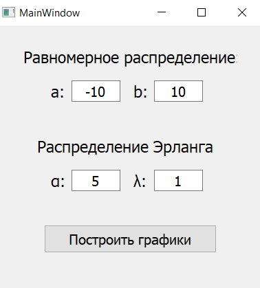
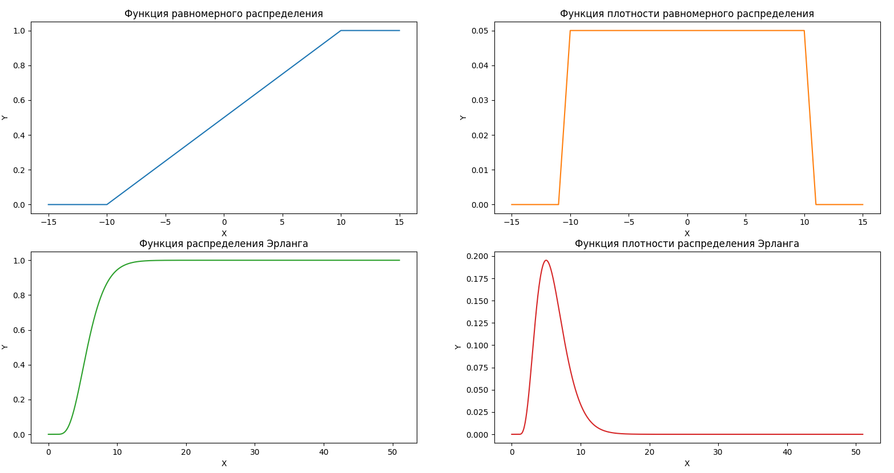

# Задание


Реализовать программу для построения графиков функции и плотности распределения для следующих распределений:

* равномерное распределение;
* распределение Эрланга.

# Равномерное распределение

Говорят, что случайная величина $X$ имеет равномерное распределение на отрезке [a; b], если ее **функция плотности распределения** имеет вид: \

$$
\large
f_X(x) =
\begin{cases}
c, & x \in [a; b] \\
0, & иначе
\end{cases}
$$

Значение константы $c$ однозначно определяется из условия нормировки: \
$$
\large
1 = \int_{a}^{b}f(x)dx = \int_{a}^{b}cdx = c(b - a) = 1, \text{тогда } c = \frac{1}{b-a}
$$
Обозначается как $X \sim R(a, b)$

**Функция распределения** равномерной случайной величины $X$: \
$$
\large
F_X(x) =
\begin{cases}
0, & x < a \\
\frac{x - a}{b - a}, & x \in [a; b] \\
1, & x > b
\end{cases}
$$

# Распределение Эрланга

Гамма функцией называется отображение
$$
\large
\Gamma(x): \mathbb{R}^{+} \longrightarrow \mathbb{R},
$$

определенное **правилом**
$$
\large
\Gamma(x) =	\int_0^{+\infty} e^{-t}\cdot t^{x-1} dt
$$
Говорят, что случайная величина $\xi$ имеет гамма распределение с параметрами $\lambda$ и $\alpha$, если ее **функция плотности распределения** вероятностей имеет вид:
$$
\large
f_{\xi}(x) =
\begin{cases}
\frac{\lambda^{\alpha}}{\Gamma(\alpha)} x^{\alpha-1} e^{-\lambda x}, & x > 0 \\
		0, & \text{иначе}
\end{cases}
$$
Обозначается как $\xi \sim \Gamma(\lambda, \alpha)$.

**Распределение Эрланга** – это гамма-распределение с параметром $\alpha$, принимающим только целые значения. 


# Текст программы

Ниже представлен текст программы, написанной на языке программирования Python.

```python
import matplotlib
import matplotlib.pyplot as plt
import numpy as np
from PyQt5 import QtWidgets
from PyQt5.QtWidgets import QMessageBox
from scipy.stats import gamma
from design import Ui_MainWindow

UNIFORM_FROM = -15
UNIFORM_TO = 15
GAMMA_FROM = 0
GAMMA_TO = 50


class MainWindow(QtWidgets.QMainWindow, Ui_MainWindow):
    def __init__(self):
        super().__init__()
        self.setupUi(self)

        self.createBtn.clicked.connect(self.show_graphics)

    @staticmethod
    def get_uniform_function(a: float, b: float, x_list: list[int]):
        y_list = []
        for x in x_list:
            if x < a:
                y_list.append(0.)
            elif a <= x <= b:
                y_list.append((x - a) / (b - a))
            else:
                y_list.append(1.)

        return y_list

    @staticmethod
    def get_uniform_density(a: float, b: float, x_list: list[int]):
        c = 1 / (b - a)
        y_list = []
        for x in x_list:
            if a <= x <= b:
                y_list.append(c)
            else:
                y_list.append(0.)

        return y_list

    @staticmethod
    def get_gamma_function(alpha: int, _lambda: int, x_list: np.ndarray[float]):
        y_list = gamma.cdf(x_list, alpha, _lambda)
        return y_list

    @staticmethod
    def get_gamma_density(alpha: int, _lambda: int, x_list: np.ndarray[float]):
        y_list = gamma.pdf(x_list, alpha, _lambda)
        return y_list

    def show_graphics(self):
        try:
            a, b = map(float, (self.rA.text(), self.rB.text()))
        except ValueError:
            QMessageBox.about(self, 'Ошибка', 'Значения параметров a и b '
                              							 'должны быть числами')
            return

        try:
            alpha, _lambda = map(int, (self.gA.text(), self.gB.text()))
        except ValueError:
            QMessageBox.about(self, 'Ошибка', 'Значения параметров alpha и '
                                              'lambda должны быть целыми числами')
            return

        matplotlib.use('QtAgg')

        x_uniform = [x for x in range(UNIFORM_FROM, UNIFORM_TO + 1)]
        y_uniform_func = self.get_uniform_function(a, b, x_uniform)
        y_uniform_den = self.get_uniform_density(a, b, x_uniform)

        x_gamma = np.linspace(GAMMA_FROM, GAMMA_TO + 1, (GAMMA_TO - GAMMA_FROM) * 50)
        y_gamma_func = self.get_gamma_function(alpha, _lambda, x_gamma)
        y_gamma_den = self.get_gamma_density(alpha, _lambda, x_gamma)

        fig, axs = plt.subplots(2, 2)
        axs[0, 0].plot(x_uniform, y_uniform_func, 'tab:blue')
        axs[0, 0].set_title('Функция равномерного распределения')
        axs[0, 1].plot(x_uniform, y_uniform_den, 'tab:orange')
        axs[0, 1].set_title('Функция плотности равномерного распределения')
        axs[1, 0].plot(x_gamma, y_gamma_func, 'tab:green')
        axs[1, 0].set_title('Функция распределения Эрланга')
        axs[1, 1].plot(x_gamma, y_gamma_den, 'tab:red')
        axs[1, 1].set_title('Функция плотности распределения Эрланга')
        
        for ax in axs.flat:
            ax.set(xlabel='X', ylabel='Y')

        plt.title = 'Функции распределения и плотности распределения'
        plt.show()
```


# Результат

В результате разработана программа, позволяющая строить графики функции и плотности равномерного распределения и распределения Эрланга. Параметры задаются в соответствующих полях. На рисунке 1.1 представлен интерфейс программы.

<figure>
    
    <figcaption>Рисунок 1.1 - Интерфейс разработанной программы</figcaption>
</figure>
На рисунке 1.2 представлены построенные графики функции и плотности равномерного распределения $(a = -10,\text{ }b = -10)$ и распределения Эрланга $(\alpha = 5,\text{ }\lambda = 1)$.

<br>

<figure>
    
    <figcaption>Рисунок 1.2 - Построенные графики функций и плотностей распределения
</figure>
