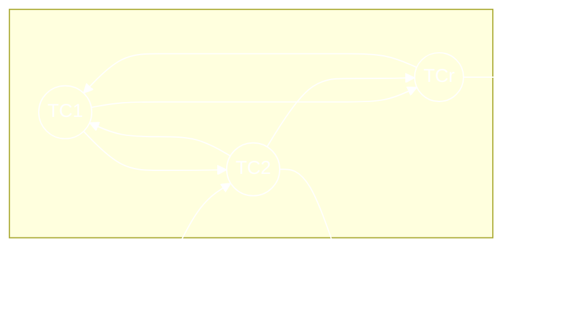

# Основная плановая производственная задача Канторовича. Открытая (к домашнему заданию)

> На следующее занятие принести ноутбуки с установленным Excel'ем

ТС – технический способ (предприятие, рабочее место и т.д.)

Ингредиенты – ресурсы материальные и прочие (электроэнергия, газ, нефть, трудовые ресурсы).

Стрелки – потоки ингредиентов.



$\to$ – потоки ингредиентов

$i$ – индекс ингредиентов, $i = 1, 2, \ldots, r$

$S$ – индекс $T_c$, $S = 1, 2, \ldots, m$

$a_{is}$ – норма участка $i\text{-го}$ ингредиента в $S\text{-м }T_c$

$b_i$ – ограничение на обмен со средой по $i\text{-му}$ ингредиенту

$X_S$ – интенсивность функционирования $S\text{-го }T_c$

$P_S$ – коэффициент эффективности $S\text{-го } T_c$

$a_{is}\text{, } b_i$ – действительные числа (>, <, 0); $X_S \ge 0$ 

```
  1   2                       r
 -------------------------------
|   |   |   |   |   |   |   |   |   
 -------------------------------
|   |   |      a_is     |   |   |   
 -------------------------------
|   |   |   |   |   |   |   |   |   
 -------------------------------
    
 -------------------------------
|   |   |   |   |   |   |   |   |  X_S   
 -------------------------------

 -------------------------------
|   |   |   |   |   |   |   |   |  
 ------------------------------- 
|   |   |   |   |   |   |   |   |  a_is * X_S 
 ------------------------------- 
|   |   |   |   |   |   |   |   |   
 -------------------------------
 
```


В столбце могут быть положительные, отрицательные числа или 0. Столбец соответствует какому-то $T_c$. Если положительное число, то значит, что данный ингредиент создается в данном технологическом способе, если отрицательное – потребляется, если 0 (пусто) – данный ингредиент в $S \text{-м }T_c$ не участвует.

Фактическое потребление и создание ресурсов ингредиентов в данном $T_c$ пропорционально интенсивности его функционирования $X_S$.

В табличке $a_{is} \cdot X_S$ – количество создаваемых потребляемых ингредиентов при данных интенсивностях $X_S$. Каждая строка в таблице – сколько создано и потреблено ингредиента по всем технологическим способам.


## Задача

Найти $X_S$, так, чтобы некий критерий оптимальности, зависящий от $X_S$ был наилучший ($\sum_S P_S \cdot X_S \to \text{max} $) при $\sum_S a_{is} \cdot X_S \ge b_i \text{, } i = 1,2, \ldots, m$.

> Последняя сумма – баланс $i\text{-го}$ ингредиента

Это задача линейного программирования, значит, может иметь решение.

```
      ^
     /|\
      |
    ----- b_i > 0 
      |
      |
     -0-
      |
      |
    ----- b_i < 0
      |

----- куда нельзя
```

Оптимальное решение – такое, что все другие не лучше.

> Подумать о единицах измерения. Для этого нужно написать формулу.

---

В централизованной экономике часто применяются другая модель – модель межотраслевого баланса Леонтьева (так называемые Леонтьевские матрицы). Отличие от задачи Конторовича: один ингредиент – один  $T_c$, поэтому технологические способы понимаются как отрасли (каждая отрасль производит свой предмет). Матричные методы решения системы уравнений.
