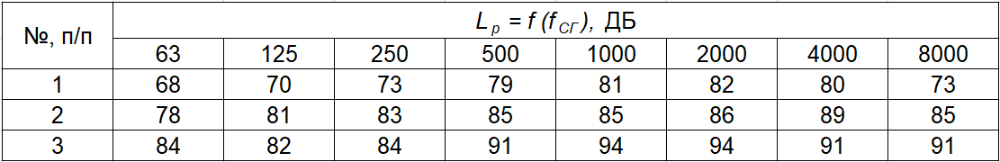
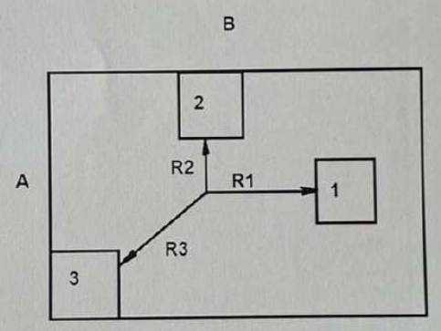
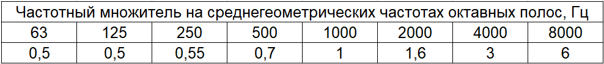
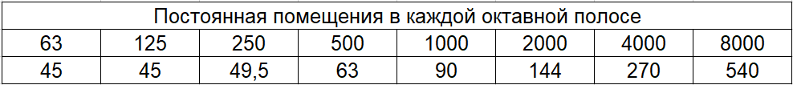
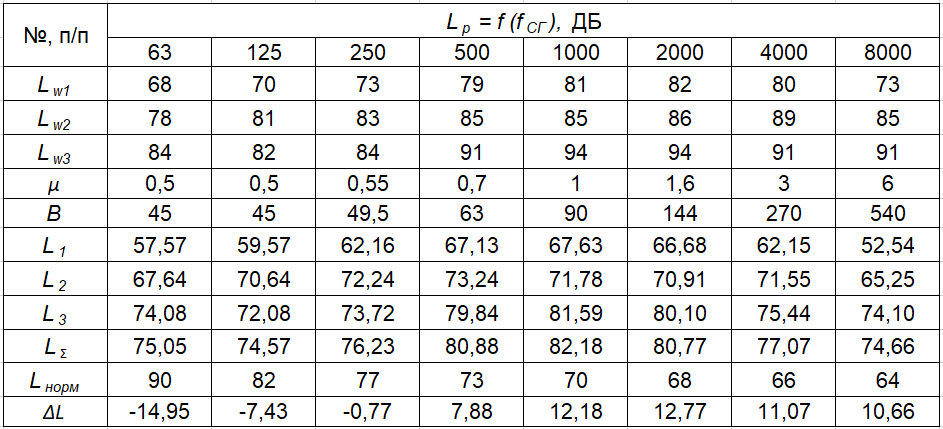
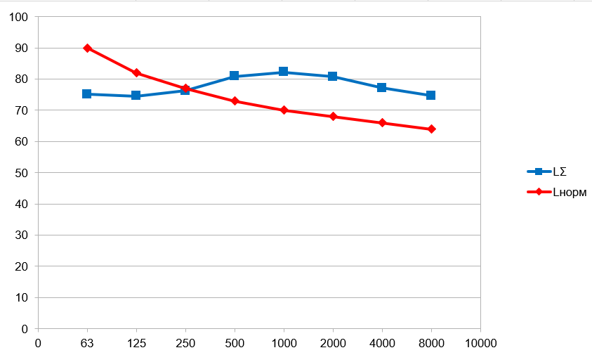

# Задание

Определить УЗД (уровни звукового давления) в расчетной точке при заданных уровнях звуковой мощности источников ($L_p=f(f_{СГ})$) (источники ненаправленные), указанном расположении расчетной точки относительно источников шума, габаритных размерах промышленного помещения. Максимальный габарит любого источника много меньше расстояния до расчетной точки. Полученные данные сравнить с нормативными значениями (СП 51.13330.2011). Построить расчетный и предельный спектры. Сделать выводы о необходимости защитных мероприятий. Предложить защитные мероприятия.

Примечание: постоянную помещения В определить в соответствии с назначением помещения и его объемом по СНиП II-12-77.

**Вариант 8**

Данные:

- схема 2;
- расположение источников в пространстве – все на полу;
- расстояния от источника до расчетной точки, м – $R_1=10$, $R_2=10$, $R_3=7$;
- уровни звуковой мощности источников – 1-7, 2-5, 3-1;
- габаритные размеры промышленного помещения, A\*B\*C, м$^3$ – $15\text{ x }30\text{ x }4$.

<figure>
    
    <figcaption>Уровни звуковой мощности источников</figcaption>
</figure>

<figure>
    
    <figcaption>Схема 2</figcaption>
</figure>

# Уровень звукового давления

## Расчет

1. Чтобы определить **УЗД в расчетной точке**, необходимо найти УЗД в этой точке от каждого источника в каждой октавной полосе по формуле:

$$
\large L_i=L_{wi}+10\lg(\frac{\Phi}{S_i}+\frac{4}{B})\text{, где} \label{1}\tag{1}
$$

- $L_{wi}$ – уровень звуковой мощности $i$-го источника;
- $\Phi$ – фактор направленности источника;
- $S_i$ – площадь поверхности излучения $i$-го источника;
- $B$ – постоянная помещения.

Суммарный УЗД рассчитывается по формуле:

$$
\large L_{\sum}=10\lg(\sum_{i=1}^N10^{0.1L_i}) \label{2}\tag{2}
$$

2. **Площадь поверхности** $i$-го источника:

$$
\large S_i=\Omega_i \cdot R^2\text{, где} \label{3}\tag{3}
$$

- $\Omega_i$ – телесный угол $i$-го источника;
- $R_i$ – расстояние между $i$-м источником и расчетной точкой.

Тогда:

$$
\large S_1 = 2\pi \cdot 10^2 = 628\text{ м}^2 \\
\large S_2 = \pi \cdot 10^2 = 314\text{ м}^2 \\
\large S_3 = \frac{\pi}{2} \cdot 7^2 = 76,93\text{ м}^2
$$

3. **Постоянная помещения**:

$$
\large B=B_{1000}\cdot \mu\text{, где} \label{4}\tag{4}
$$

- $B_{1000}$ – постоянная помещения в полосе 1000 Гц;
- $\mu$ – частотный множитель

Объем помещения:

$$
\large V = 15 \cdot 30 \cdot 4 = 1800 \text{ м}^3
$$

В соответствии со СНиП II-12-77 (тип помещения – с небольшим количеством людей):

$$
\large B_{1000} = \frac{V}{20} = \frac{1800}{20} = 90
$$

Так как объем помещения больше 1000 м$^3$, то следует воспользоваться следующими значениями:

Подставляя полученные значения в формулу $\eqref{4}$, получаем значения постоянной помещения:

4. Результаты подставим в формулы $\eqref{1}$ и $\eqref{2}$. Результирующая таблица:

5. Сравним полученные данные с нормативными значениями и построим график:

## Вывод

Таким образом, можно увидеть, что до 250 Гц уровень шума не превышает норму. При значениях выше 250 Гц следует проводить защитные мероприятия. Например, применение средств индивидуальной защиты, звукопоглощающих конструкций, глушителей шума, уплотнение по периметру притворов окон, ворот, дверей.
