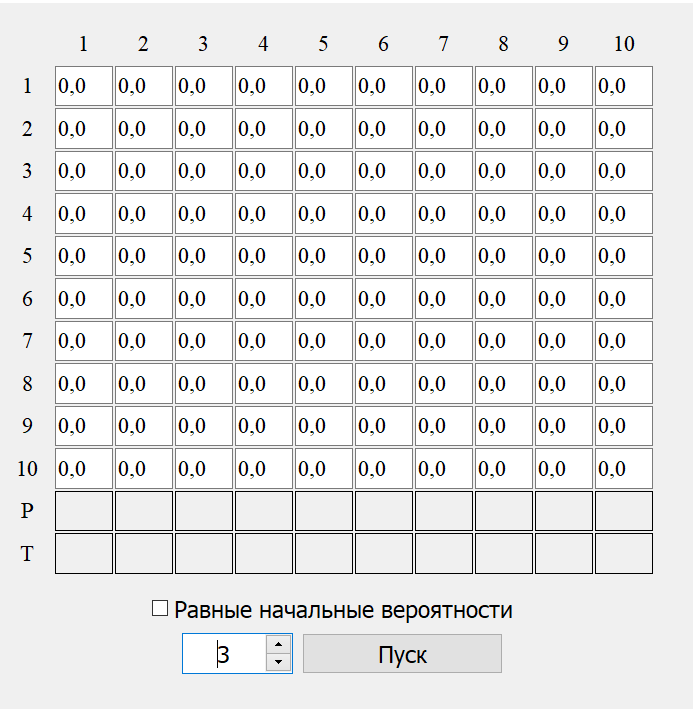
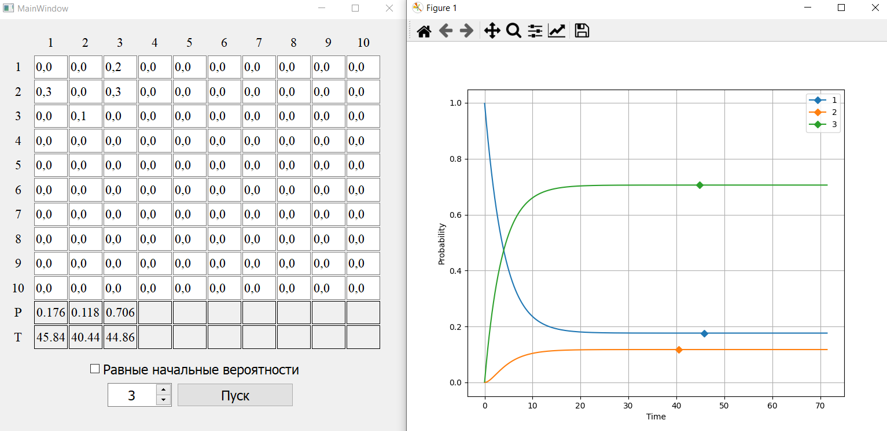
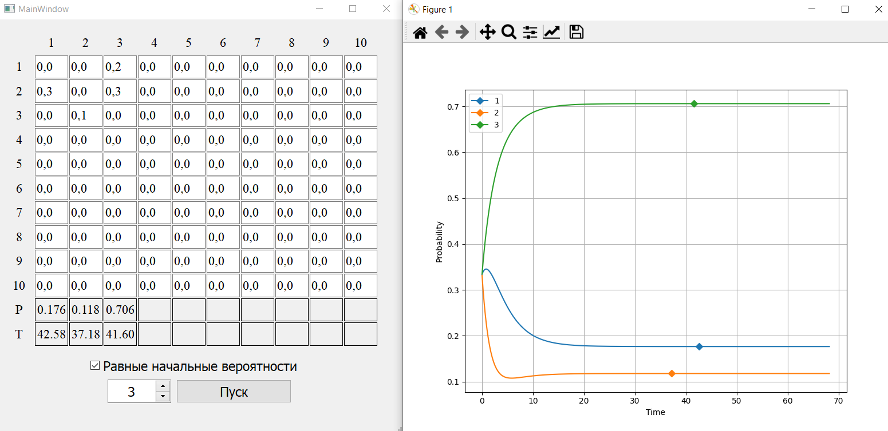
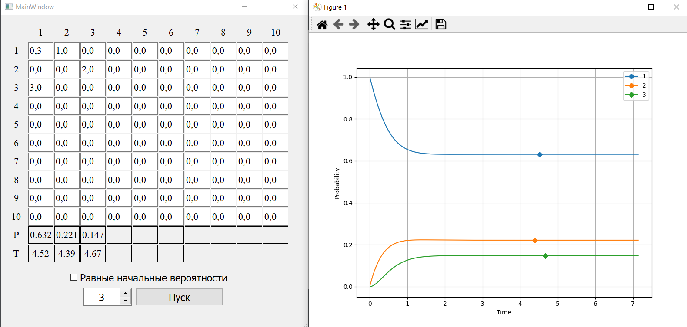
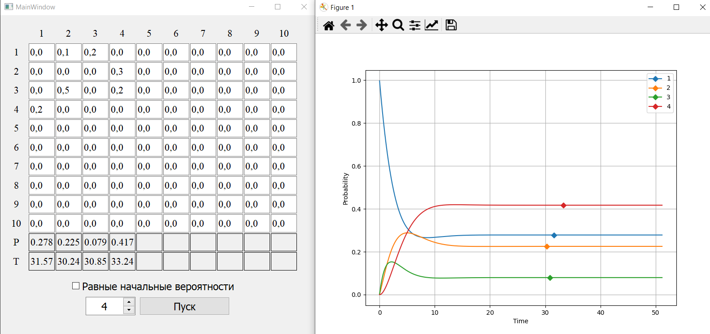

# Задание

Разработать программу для определения времени пребывания сложной системы в каждом из состояний. Количество состояний $\le 10$. Реализовать при помощи графического интерфейса: 

- возможность выбора количества состояний и значений интенсивностей переходов в матрице;
- отображение результатов работы программы (графики вероятностей состояний, значение и время стабилизации вероятности для каждого состояния).

# Марковский случайные процессы

Для математического описания функционирования устройства, развивающегося в форме случайного процесса, может быть с успехом применен математический аппарат, разработанный в теории вероятности для так называемых *марковских случайных процессов*.

Случайный процесс протекающий в некоторой системе $S$, называется **марковским**, если он обладает следующим свойством: для каждого момента времени, вероятность любого состояния системы в будущем зависит только от ее состояния в настоящем и не зависит от того, когда и каким образом система пришла в это состояние.

Для марковского процесса обычно составляются *уравнения Колмогорова*, представляющие следующие соотношения:

$F = (p'(t),p(t),\Lambda) = 0$, где

- $\Lambda$ – некоторый набор коэффициентов,
- $p$ – вероятность,
- $p'$ – производная вероятности.

Интегрирование системы дает искомые вероятности состояний, как функций от времени. Начальные условия берутся в зависимости от того, какого было начальное состояние системы.

# Текст программы

Ниже представлен текст программы, написанной на языке программирования Python.

```python
N = 10
EPS = 1e-8


class Model:
    def __init__(self, n: int, same: bool = False):
        self.__n = n
        self.__T = 0.
        self.__prob: list[float] = [0. for _ in range(N)]
        self.__time: list[float] = [0. for _ in range(N)]
        self.__lambda: list[list[float]] = [[0. for _ in range(N)] for _ in range(N)]

        if not same:
            self.__prob[0] = 1
        else:
            for i in range(n):
                self.__prob[i] = 1 / n

    def step(self, delta_t: float) -> bool:
        prob: list[float] = [self.__prob[i] for i in range(N)]

        for i in range(self.__n):
            for j in range(self.__n):
                if i != j:
                    prob[i] += delta_t * (self.__prob[j] * self.__lambda[j][i] - 
                                          self.__prob[i] * self.__lambda[i][j])

        is_stable: bool = self.__is_stable()
        self.__prob = [prob[i] for i in range(N)]

        self.__set_stable_T()
        self.__T += delta_t

        return is_stable

    def get_lambda_element(self, row: int, column: int) -> float:
        return self.__lambda[row][column]

    def set_lambda_element(self, row: int, column: int, value: float):
        self.__lambda[row][column] = value

    def add_to_lambda_element(self, row: int, column: int, value: float):
        self.__lambda[row][column] += value

    def get_n(self) -> int:
        return self.__n

    def get_T(self) -> float:
        return self.__T

    def get_prob_element(self, index: int) -> float:
        return self.__prob[index]

    def get_time_element(self, index: int) -> float:
        return self.__time[index]

    def __kolmogorov(self) -> list[float]:
        result: list[float] = [0 for _ in range(N)]

        for i in range(self.__n):
            for j in range(self.__n):
                if i != j:
                    result[i] += (self.__prob[j] * self.__lambda[j][i] - 
                                  self.__prob[i] * self.__lambda[i][j])

        return result

    def __is_stable(self) -> bool:
        result: list[float] = self.__kolmogorov()

        for i in range(self.__n):
            if abs(result[i]) > EPS / 10:
                return False
        return True

    def __set_stable_T(self):
        k: list[float] = self.__kolmogorov()

        for i in range(self.__n):
            if abs(k[i]) < EPS * 100 and self.__time[i] <= EPS:
                self.__time[i] = self.__T
            elif abs(k[i]) > EPS * 100 and self.__time[i] > EPS:
                self.__time[i] = 0.
```

# Результат

В результате разработана программа, позволяющая строить графики вероятностей состояний, получать значение и время стабилизации вероятности для каждого состояния. На рисунке 1.1 представлен интерфейс. 

<figure>
    
    <figcaption>Рисунок 1.1 - Интерфейс разработанной программы</figcaption>
</figure>
Условием стабилизации вероятности $i$-ого состояния принимается величина $P_i(t)$, где $t$ - наименьшее время, при котором ${P'}_i(t) < 10^{-8}$. Реализована возможность задавать два начальных условия:

- в нулевой момент времени система находится в первом состоянии;
- в нулевой момент времени система находится в каждом состоянии с равной вероятностью.

На рисунке 1.2 представлен результат работы программы для трех состояний.

<br>

<figure>
    
    <figcaption>Рисунок 1.2 - Результат для трех состояний
</figure>

Проверка значений:

$$
\large
\begin{cases}
-0.2 \cdot 0.176 + 0.3 \cdot 0.118 \approx 0 \\
-(0.3 + 0.3) \cdot 0.118 + 0.1 \cdot 0.706 \approx 0 \\
-0.1 \cdot 0.706 + (0.2 \cdot 0.176 + 0.3 \cdot 0.118) = 0
\end{cases}
$$

На рисунке 1.3 представлен результат работы программы для трех состояний при равных начальных состояниях.

<br>

<br>

<br>

<br>

<figure>
    
    <figcaption>Рисунок 1.3 - Результат для трех состояний при равных начальных состояниях
</figure>

На рисунке 1.4 представлен результат работы программы для трех состояний с переходом состояния в само себя. 

<br>

<figure>
    
    <figcaption>Рисунок 1.4 - Результат для трех состояний с переходом состояния в само себя
</figure>
<br>

<br>

<br>

Проверка значений:

$$
\large
\begin{cases}
(-1.0 + 0.3) \cdot 0.632 + 3.0 \cdot 0.147 \approx 0 \\
-2.0 \cdot 0.221 + (1.0 - 0.3) \cdot 0.632 \approx 0 \\
-3.0 \cdot 0.147 + 2.0 \cdot 0.221 \approx 0
\end{cases}
$$

На рисунке 1.5 представлен результат работы программы для четырех состояний.

<br>

<figure>
    
    <figcaption>Рисунок 1.5 - Результат для четырех состояний
</figure>
Проверка значений:

$$
\large
\begin{cases}
-(0.1 + 0.2) \cdot 0.278 + 0.2 \cdot 0.417 = 0 \\
-0.3 \cdot 0.225 + (0.1 \cdot 0.278 + 0.5 \cdot 0.079) \approx 0 \\
-(0.5 + 0.2) \cdot 0.079 + 0.2 \cdot 0.278 \approx 0 \\
-0.2 \cdot 0.417 + (0.3 \cdot 0.225 + 0.2 \cdot 0.079) \approx 0
\end{cases}
$$

