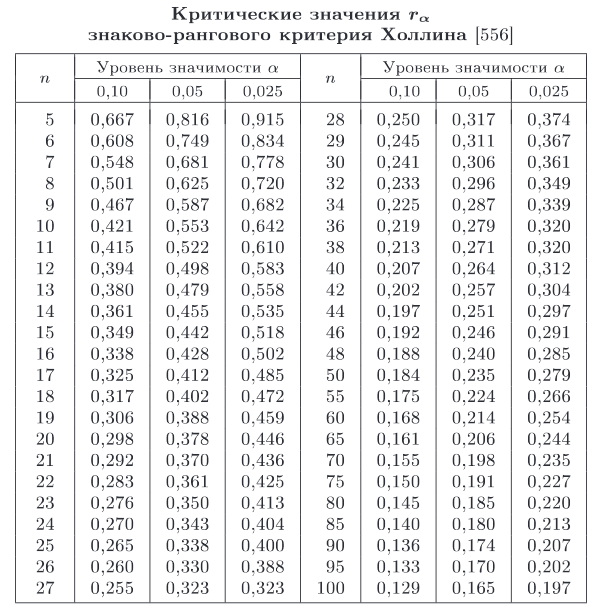
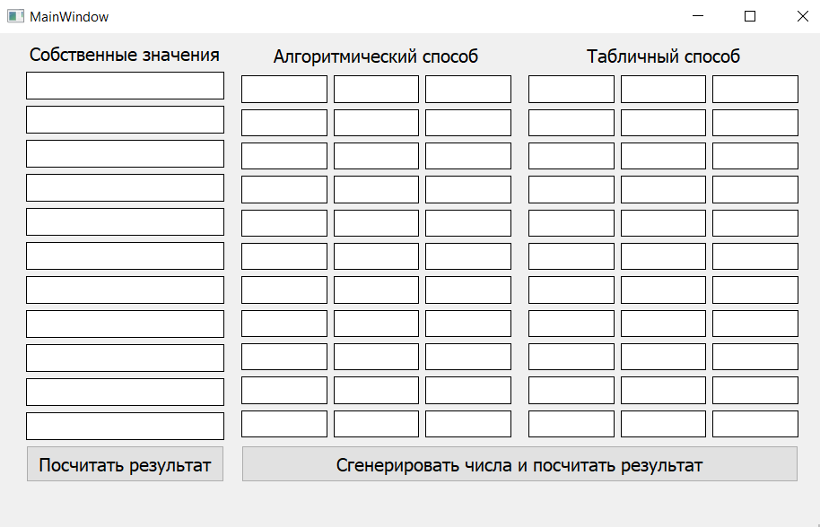
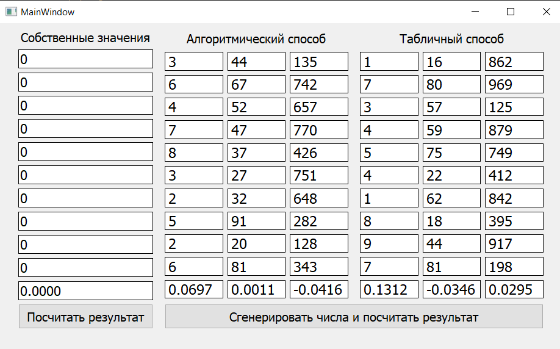
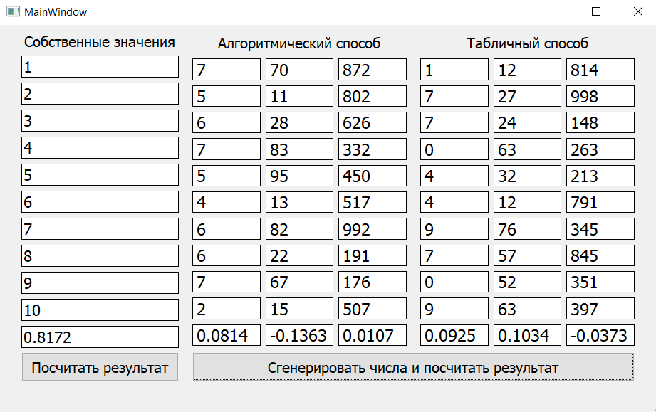
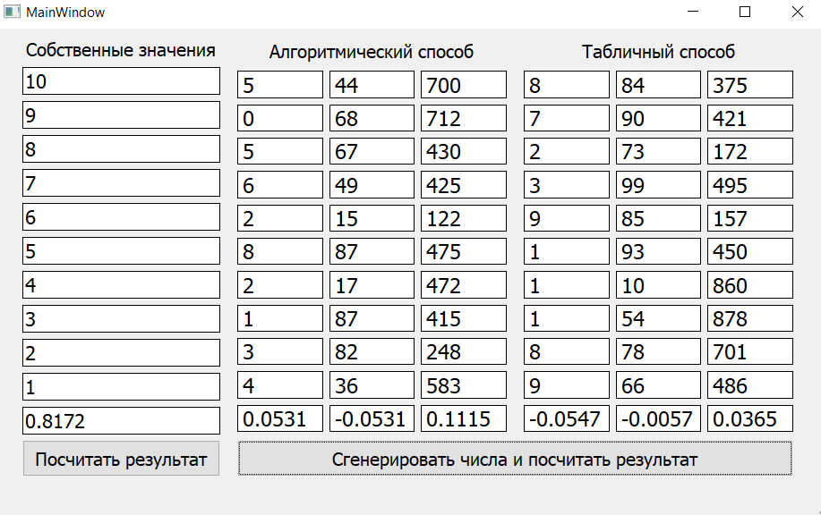
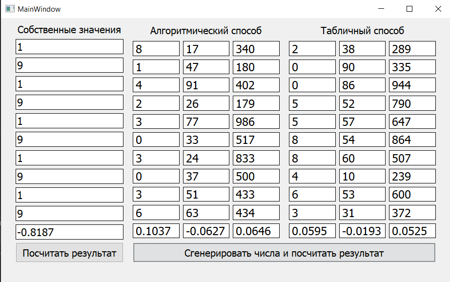

# Задание

Используя алгоритмический и табличный метод сгенерировать последовательность из 100 одноразрядных, двухразрядных и трёхразрядных чисел. Отобразить первые 10 в графическом интерфейсе. Составить статистический критерий оценки случайности последовательностей и вывести его значение для каждой последовательности. Также предусмотреть возможность получения оценки  для 10 чисел, введённых пользователем. 

# Методы получения последовательности случайных чисел

Существует три метода получения последовательности случайных чисел:

- аппаратный (физический);
- табличный (файловый);
- алгоритмический (программный).

В данной лабораторной работе рассмотрены и реализованы два последних.


## Табличная схема

Случайные числа оформляются в виде таблицы и помещаются во внешнюю или оперативную память. В лабораторной работе файлы были сгенерированы при помощи стандартной библиотеки `random` языка программирования `Python`. Начальное значение генерируется таким же способ и используется для смещения относительно начала файла.


## Алгоритмический способ

Способ основан на формировании случайных чисел с помощью специальных алгоритмов. Очередное полученное значение используется для генерации последующих чисел. 

В данной работе был использован мультипликативным конгруэнтный метод. Последовательность вычисляется по формуле:

$$
\large
X_{n+1} = (aX_n + c)\bmod m \text{, }n \ge 1\text{,}
$$

при этом $c=0$.

Самым известным генератором подобного рода является так называемый минимальный стандартный генератор случайных чисел, предложенный Стивеном Парком и Кейтом Миллером в 1988 году. Для него $a = 16807$,                      $m  =        2147483647$.

В данной лабораторной работе в качестве начального значения $X_1$ используется текущее время в секундах.


## Критерий оценки

В качестве критерии оценки случайности последовательности взят критерий знаково-рейтинговый критерий Холлина, основанный на статистике:

$$
\large
r = \frac{1}{k(n-1)}\sum_{i=2}^n\delta\Big[(x_i-\tilde{x})(x_{i-1}\tilde{x})\Big]R_iR_{i-1}\text{,}
$$

где 

- $k$ –коэффициент, зависящий от объема выборки (значения подбираются по таблице);
- $\tilde{x}$ – медиана вариационного ряда $x_{(1)} \le x_{(2)} \le \dots \le x_{(n)}$;
- $R_i$ – ранг величины $z_i = |x_i-\tilde{x}|$ в упорядоченном по возрастанию ряду значений $z_1 \le z_2 \le \dots z_n$;
- $\delta = \begin{cases} 1, & y > 0; \\-1, & y < 0\\  0, & y = 0. \end{cases}$

 Ряд значений $x_i$ признается случайным, еслиr $|r|<r_{\alpha}$. Критические значения представлены на рисунке 1.1. При этом если $r = 0$, то ряд не будет являться случайным.

<figure>
    
    <figcaption>Рисунок 1.1 - Критические значения для критерия Холлина
</figure>


# Текст программы

Ниже представлен текст программы, написанной на языке программирования Python.

```python
import random as r
import time


class AlgorithmGenerator:
    def __init__(self, n_min: int, n_max: int):
        self.n_min: int = n_min
        self.n_max: int = n_max

    def get_random_numbers(self, n: int, seed: int = -1) -> list[int]:
        if seed == -1:
            seed = round(time.time())
        a = 16807
        m = 0x7fffffff

        numbers: list[int] = []
        for i in range(n):
            seed = seed * a % m
            numbers.append(seed % (self.n_max - self.n_min) + self.n_min)

        return numbers


class TableGenerator:
    def __init__(self, n_min: int, n_max: int):
        self.n_min: int = n_min
        self.n_max: int = n_max
        self.random_cnt: int = (self.n_max - self.n_min) * 1000

    def fill_file_by_random(self, filename: str):
        with open(filename, 'w') as f:
            for i in range(self.random_cnt):
                f.write(str(r.randint(self.n_min, self.n_max)) + '\n')

    def get_random_numbers(self, filename: str, n: int, seed: int = -1) -> list[int]:
        if seed == -1:
            seed = r.randint(0, self.random_cnt)

        numbers: list[int] = []
        with open(filename) as f:
            all_numbers: list[int] = [int(x) for x in f.read().split()]

        for i in range(seed, seed + n):
            numbers.append(all_numbers[i % self.random_cnt])

        return numbers


class HollinCriterion:
    @staticmethod
    def count(x: list[int]) -> float:
        def R(idx: int) -> float:
            indices: list[int] = [i + 1 for i, value in enumerate(var_series_z) if value == z[idx]]
            return sum(indices) / len(indices)

        def sign(y: int) -> int:
            if y > 0:
                return 1
            elif y < 0:
                return -1
            else:
                return 0

        def get_median() -> int | float:
            if n % 2:
                return var_series[(n - 1) // 2]
            else:
                return (var_series[n // 2 - 1] + var_series[(n // 2)]) / 2

        def get_k() -> float:
            def k_func(n1, n2, k1, k2) -> float:
                return (n - n1) * (k2 - k1) / (n2 - n1) + k1

            if 5 <= n < 10:
                return k_func(5, 10, 10.11, 36.95)
            elif 10 <= n < 20:
                return k_func(10, 20, 36.95, 140.62)
            elif 20 <= n <= 50:
                return k_func(20, 50, 140.62, 851.62)
            elif 50 <= n <= 100:
                return k_func(50, 100, 851.62, 3370)
            elif 100 <= n < 200:
                return k_func(100, 200, 3370, 13407)
            elif 200 <= n <= 400:
                return k_func(200, 400, 13407, 53480)
            else:
                raise ValueError(f'There is not value for n = {n}')

        n: int = len(x)
        var_series: list[int] = list(sorted(x))  # вариационный ряд
        median: int | float = get_median()
        k: float = get_k()
        z: list[int | float] = [abs(x[i] - median) for i in range(n)]
        var_series_z: list[int | float] = list(sorted(z))
        series: = [sign((x[i] - median) * (x[i - 1] - median)) * R(i) * R(i - 1)
                   for i in range(1, n)]
        return 1 / (k * (n - 1)) * sum(series)
```

# Результат

В результате разработана программа, позволяющая получить случайные последовательности чисел табличным и алгоритмическим способами, вводить с клавиатуры и получать значения статистики, на которой основан критерий Холлина. На рисунке 2.1 представлен интерфейс. Последняя строка в каждом столбце – значение статистики.

<figure>
    
    <figcaption>Рисунок 2.1 - Интерфейс разработанной программы</figcaption>
</figure>

На рисунках 2.2 – 2.5 представлены результаты работы программы для различных значений с клавиатуры. При этом при каждом запуске генерировалась новая последовательность случайных чисел алгоритмическим и табличным способами.

<figure>
    
    <figcaption>Рисунок 2.2 - Результат для одинаковых чисел
</figure>

<figure>
    
    <figcaption>Рисунок 2.3 - Результат для возрастающей последовательности
</figure>

<figure>
    
    <figcaption>Рисунок 2.4 - Результат для убывающей послежовательности
</figure>

<figure>
    
    <figcaption>Рисунок 2.5 - Результат для чередующихся чисел
</figure>


Можно увидеть, что для всех тестов критерий показывает правильный результат в соответствие с таблицей – для случайных последовательностей значения по модулю низкие, для неслучайных – высокие или равны 0.

