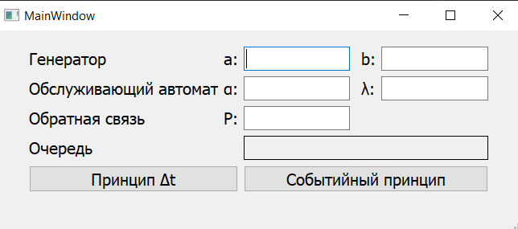
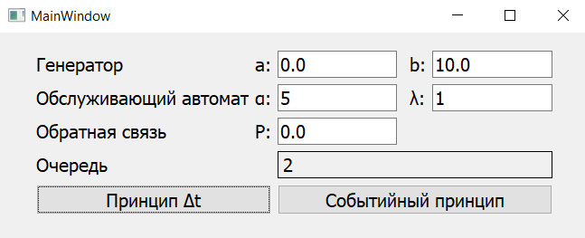
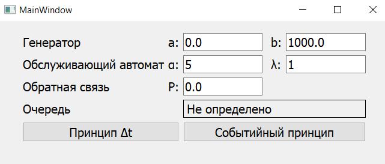
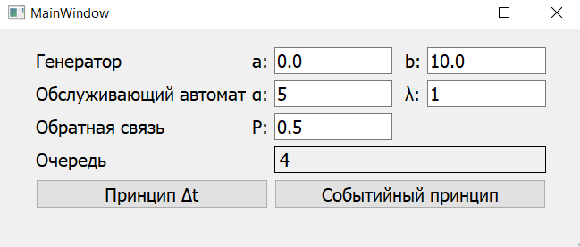
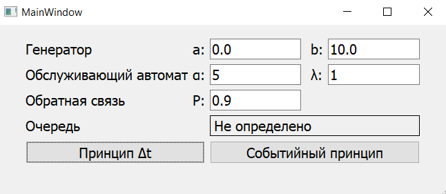

# Задание

Промоделировать систему, состоящую из генератора, очереди и обслуживающего автомата. Генератор создаёт сообщения по равномерному закону, откуда они поступают в очередь. Из очереди сообщения получает  обслуживающий автомат, работающий по закону Эрланга. Определить длину очереди, при которой не произойдёт потери сообщений. Промоделировать двумя принципами: $\Delta t$ и событийным.


# Моделирование системы

## Принцип $\Delta t$

Принцип $\Delta t$ заключается в последовательном анализе состояний всех блоков в момент $t + \Delta t$ по заданному состоянию блоков в момент $t$. При этом новое состояние блоков определяется в соответствии с их алгоритмическим описанием с учетом действующих случайных факторов, задаваемых распределениями вероятности. В результате принимается решение о том, какие общесистемные события должны имитироваться программной моделью на данный момент времени. Основной недостаток: значительные затраты машинного времени на реализацию моделирования системы. При недостаточно малом $\Delta t$ появляется опасность пропуска отдельных событий в системе, что исключает возможность получения адекватных результатов при моделировании. К достоинствам относится равномерная протяжка времени.


## Событийный принцип

При использовании событийного принципа, состояние всех блоков имитационной модели анализируется лишь в момент появления какого-либо события. Момент поступления следующего события определяется минимальным значением из списка будущих событий, представляющего собой совокупность моментов ближайшего изменения состояния каждого из блоков системы.


# Текст программы

Ниже представлен текст программы, написанной на языке программирования Python.

```python
import random
from typing import Optional
from scipy.stats import gamma
import queue

EPS = 1e-5


class Request:
    def __init__(self, create_time: float):
        self.__create_time = create_time
        self.__serve_time = -1.

    def is_served(self):
        return self.__serve_time >= 0

    def get_creation_time(self) -> float:
        return self.__create_time

    def get_serve_time(self) -> float:
        return self.__serve_time

    def set_serve_time(self, value: float):
        self.__serve_time = value


class Generator:
    def __init__(self, a: float, b: float, current_time: float = 0.):
        self.__a = a
        self.__b = b
        self.__request: Optional[Request] = None

        self.create_request(current_time)

    def create_request(self, current_time: float = 0.) -> Request:
        old_request = self.__request
        self.__request = Request(current_time + self.__a +
                                 (self.__b - self.__a) * random.random())
        return old_request

    def get_average(self) -> float:
        return (self.__a + self.__b) / 2

    def when_ready(self) -> float:
        return self.__request.get_creation_time()

    def is_ready(self, current_time: float) -> bool:
        return (self.__request is not None and
                current_time >= self.__request.get_creation_time() - EPS)


class Service:
    def __init__(self, alpha: int, _lambda: int, free_back_p: float = 0.):
        self.__alpha = alpha
        self.__lambda = _lambda
        self.__free_back_p = free_back_p
        self.__request: Optional[Request] = None
        self.__cur_x = 0.

    def when_ready(self) -> float:
        return self.__request.get_serve_time()

    def is_empty(self) -> bool:
        return self.__request is None

    def is_ready(self, current_time: float) -> bool:
        return (self.__request is not None and
                current_time >= self.__request.get_serve_time() - EPS)

    def delay(self) -> float:
        self.__cur_x += 0.05
        acc = gamma.cdf(self.__cur_x, self.__alpha, self.__lambda)
        return acc

    def put(self, request: Request, current_time: float):
        self.__request = request
        self.__request.set_serve_time(current_time + self.delay())

    def get(self, current_time: float) -> Request:
        request = self.__request
        self.__request = None

        if random.random() < self.__free_back_p:
            request = Request(current_time)

        return request


class RequestQueue(queue.Queue):
    def __init__(self):
        super().__init__()
        self.__peak_len = 0
        self.__peak_time = -1.

    def push(self, request: Request, current_time: float):
        super().put(request)
        if self.qsize() > self.__peak_len:
            self.__peak_len = self.qsize()
            self.__peak_time = current_time

    def pop(self):
        return self.get()

    def get_peak_time(self) -> float:
        return self.__peak_time

    def get_peak_len(self) -> int:
        return self.__peak_len


class DeltaTModel:
    def __init__(self, generator: Generator, service: Service):
        self.__current_time = 0.
        self.__generator = generator
        self.__service = service
        self.__queue = RequestQueue()

        self.__created_n = 0
        self.__served_n = 0
        self.__returned_n = 0
        self.is_overflowed = False

    def handle_generator(self):
        if self.__generator.is_ready(self.__current_time):
            request = self.__generator.create_request(self.__current_time)
            self.__queue.push(request, self.__current_time)
            self.__created_n += 1

    def handle_service(self):
        if self.__service.is_ready(self.__current_time):
            request = self.__service.get(self.__current_time)
            if not request.is_served():
                self.__queue.push(request, self.__current_time)
                self.__returned_n += 1
            else:
                self.__served_n += 1

        if self.__service.is_empty() and self.__queue.qsize() > 0:
            self.__service.put(self.__queue.pop(), self.__current_time)

    def run(self, delta_t: float = 0.01, end_time: float = 1e5) -> int:
        while (self.__current_time - self.__queue.get_peak_time() <
               1000 * self.__generator.get_average()
               and self.__current_time < end_time):

            self.handle_generator()
            self.handle_service()
            self.__current_time += delta_t

        if self.__current_time > 1e5:
            self.is_overflowed = True
            return -1

        return self.__queue.get_peak_len()


class EventModel:
    def __init__(self, generator: Generator, service: Service):
        self.__current_time = 0.
        self.__generator = generator
        self.__service = service
        self.__queue = RequestQueue()

        self.__created_n = 0
        self.__served_n = 0
        self.__returned_n = 0
        self.is_overflowed = False

        self.__events: list[float] = [self.__generator.when_ready()]

    def handle_generator(self):
        if self.__generator.is_ready(self.__current_time):
            request = self.__generator.create_request(self.__current_time)
            self.__queue.push(request, self.__current_time)
            self.__created_n += 1

            self.__events.append(self.__generator.when_ready())

    def handle_service(self):
        if self.__service.is_ready(self.__current_time):
            request = self.__service.get(self.__current_time)
            if not request.is_served():
                self.__queue.push(request, self.__current_time)
                self.__returned_n += 1
            else:
                self.__served_n += 1

        if self.__service.is_empty() and self.__queue.qsize() > 0:
            self.__service.put(self.__queue.pop(), self.__current_time)
            self.__events.append(self.__service.when_ready())

    def run(self, end_time: float = 1e5) -> int:
        while (self.__current_time - self.__queue.get_peak_time() <
               1000 * self.__generator.get_average() and
               self.__current_time < end_time):

            self.handle_generator()
            self.handle_service()

            self.__current_time = min(self.__events)
            self.__events.remove(self.__current_time)

        if self.__current_time > 1e5:
            self.is_overflowed = True
            return -1

        return self.__queue.get_peak_len()
```


# Результат

Условием остановки поиска – обслуживание 1000 сообщений без изменения максимальной длины очереди. Если такое событие не происходит за $10^5$ заявок, принимается, что генерация вместе с обратной связью помещают сообщения с большей интенсивностью, чем успевает обрабатывать их обслуживающий автомат. Со временем длина очереди будет только расти, поэтому для любой выбранной очереди в определенный момент произойдут потери.

В результате разработана программа, позволяющая промоделировать систему принципами $\Delta t$ и событийным с указанием параметров (a и b – для равномерного распределения, $\alpha$ и $\lambda$ – для распределения Эрланга, P – обратной связи с определенной долей вероятности) и получить максимальный размер очереди. На рисунке 1.1 представлен интерфейс.

<figure>
    
    <figcaption>Рисунок 1.1 - Интерфейс разработанной программы</figcaption>
</figure>


В результате экспериментов было установлено, что для обоих принципов результат одинаковый.

На рисунках 1.2 – 1.5 представлены результаты работы программы при различных параметрах.

<figure>
    
    <figcaption>Рисунок 1.2 - Система при более интенсивном обслуживании
</figure>


<figure>
    
    <figcaption>Рисунок 1.3 - Система при более интенсивной генерации
</figure>


<figure>
    
    <figcaption>Рисунок 1.4 - Система при обратной связи в 50%
</figure>


<figure>
    
    <figcaption>Рисунок 1.5 - Система при обратной связи в 90%
</figure>


