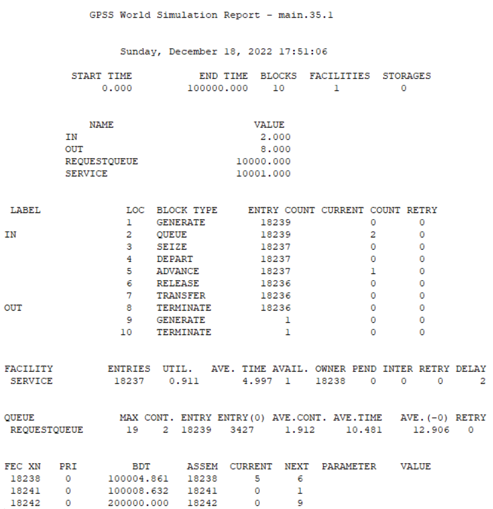
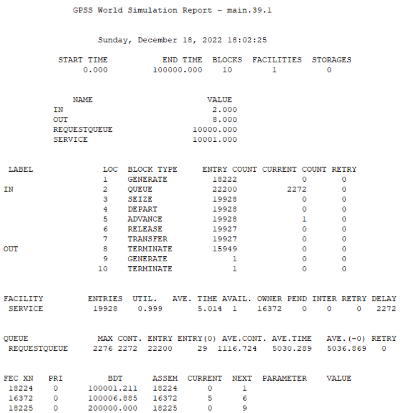
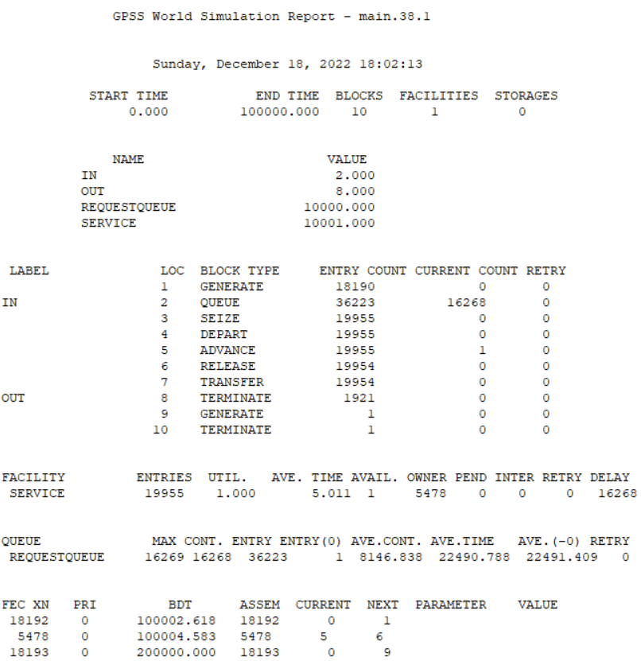

# Задание

Промоделировать систему, состоящую из генератора, очереди и обслуживающего автомата. Генератор создаёт сообщения по равномерному закону, откуда они поступают в очередь. Из очереди сообщения получает  обслуживающий автомат, работающий по закону Эрланга. Определить длину очереди, при которой не произойдёт потери сообщений. Промоделировать на языке моделирования GPSS.


# Событийный принцип моделирования

При использовании событийного принципа, состояние всех блоков имитационной модели анализируется лишь в момент появления какого-либо события. Момент поступления следующего события определяется минимальным значением из списка будущих событий, представляющего собой совокупность моментов ближайшего изменения состояния каждого из блоков системы.


# Текст программы

Ниже представлен текст программы.

```GPSS
; Модель
    GENERATE (UNIFORM(1, 1.0, 10.0))

IN  QUEUE RequestQueue
    SEIZE Service
    DEPART RequestQueue
    ADVANCE (GAMMA(1, 0, 1, 5))
    RELEASE Service
    TRANSFER 0.0,OUT,IN  ; Обратная связь

OUT TERMINATE 0

; Таймер
    GENERATE 100000
    TERMINATE 1
    START 1
```


# Результат

В результате разработана программа, позволяющая промоделировать систему событийным принципом с указанием параметров.

На рисунке 1.1 представлен результаты работы программы при $a=1.0$, $b = 10.0$, $\alpha=5$, $\lambda=1$. Максимальный размер очереди – 19.

<figure>
    
    <figcaption>Рисунок 1.1 &ndash; Результат работы программы
</figure>

На рисунках 1.2-1.3 представлены результаты работы с такими же параметрами, но с обратной связью в 20% и 90% соответственно.

<figure>
    
    <figcaption>Рисунок 1.2 &ndash; Результат работы программы с обратной связью, равной 0.2
</figure>

<figure>
    
    <figcaption>Рисунок 1.3 &ndash; Результат работы программы с обратной связью, равной 0.9
</figure>


