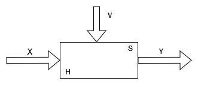

# Лекция 5

## Базовые понятия в теории систем

**Система** – это множество элементов, находящихся в отношениях и связях между собой.

**Элемент** – часть системы, представление о которой нецелесообразно подвергать дальнейшему членению.

**Сложная система** – это система, характеризующаяся большим числом элементов (2 или более) и, что наиболее важно, большим числом взаимосвязей элементов. Сложность системы определяется также видом взаимосвязей элементов, свойствами целенаправленности, целостности, членимости, *иерархичности*, многоаспекстности.

**Подсистема** – часть системы (подмножество элементов и их взаимосвязи), которая имеет свойства системы.

**Надсистема** – система, по отношению к которой рассматриваемая система является подсистемой.

**Структура** – отображение совокупности элементов системы и их взаимосвязи. Понятие структуры отличается от понятия системы также тем, что при описании структуры принимают во внимание лишь типы элементов и их связи без конкретизации значений их параметров.

**Параметр** – величина, выражающая свойства или системы, или ее части, или влияющие на систему среды.

## Характеристики сложной системы	

1) Целенаправленность – свойство искусственной системы, выражающее назначение системы (необходима для оценки эффективности вариантов системы).
2) Целостность – свойство системы, характеризующее взаимосвязанность элементов и наличие зависимости выходных параметров от параметров элементов. При этом большинство выходных параметров не являются простым повторением или суммой параметров элементов.
3) Иерархичность – свойство сложной системы, выражающее возможность и целесообразность ее иерархичного описания, то есть представление в виде нескольких уровней, между компонентами которых имеются отношения "целые – часть".

## Задачи сложной системы

1) Modeling – создание моделей сложных систем.
2) Simulation – анализ свойств систем на основе исследования их моделей. 

## Основы теории моделирования

Модель объекта можно представить как совокупность множества величин, описывающих процесс функционирования реальной системы и образующие в общем случае следующие подмножества:

- совокупность входных воздействий ($x_i \in X$, $i = \overline{1,n_X}$) 
- совокупность воздействий внешней среды ($v_i \in V$, $i = \overline{1, n_V}$)
- совокупность собственных (внутренних параметров системы) ($h_i \in H$, $i=\overline{1, n_H}$)
- совокупность выходных характеристик системы ($y_i \in X$, $i = \overline{1, n_Y}$)

В общем случае $x_i$, $v_i$, $h_i$, $y_i$ являются элементами непересекающихся подмножеств и содержат как недетерминированные, так и стохастические составляющие. При моделировании системы S входные воздействия, воздействия внешней среды и внутренние параметры являются независимыми – экзогенными, которые в общем случае имеют вид:

$$
\overrightarrow{x(t)} = (x_1(t), x_2(t), \dots, x_{n_x}(t))\\
\overrightarrow{v(t)} = (v_1(t), v_2(t), \dots, v_{n_v}(t))\\
\overrightarrow{h(t)} = (h_1(t), h_2(t), \dots, h_{n_h}(t))
$$

А выходные характеристики системы являются зависимыми, то есть эндогенными элементами:

$$
\overrightarrow{y(t)} = (y_1(t), y_2(t), \dots, y_{n_y}(t))
$$

Процесс функционирования системы описывается во времени некоторым оператором, который в общем случае преобразует независимые переменные в зависимые:

$$
\overrightarrow{y(t)} = F_S(\text{ }\overrightarrow{x},
\text{ }\overrightarrow{v}, \text{ }\overrightarrow{h}, \text{ }t)
$$

Эта зависимость является **законом функционирования сложной системы S**. В общем виде он может быть задан в виде функции, функционала, логических условий в алгоритмическом или табличном виде.

Под алгоритмом функционирования сложной системы подразумевается метод получения выходных характеристик с учетом входных воздействий $x(t)$, воздействий внешней среды $v(t)$ и внутренних параметров системы $h(t)$.

Отношение может быть получено и через понятие состояния системы (через свойства системы конкретной модели). Эти же состояния характеризуются вектором состояний:

$$
\overrightarrow{z} = (z_1, z_2, \dots,z_k), \text{ }k=\overline{1, n_Z}
$$

Если рассматривать процесс функционирования системы S как последовательную смену состояний, то они могут быть интерпретированы как координаты точки в $k$-мерном фазовом пространстве, причем каждой реализации процесса будет соответствовать некоторая фазовая траектория. Совокупность всех возможных состояний системы называется **пространством состояний объекта моделирования**.

Состояние системы (момент времени от $t_0$ до $t_k$) полностью определяется начальными условиями $z^0$:

$$
\overrightarrow{z^0} = (z^0_1, z^0_2, \dots, z^0_k),
$$

где $z_1^0$ – свойство системы в момент времени $t_0$.

Состояние системы S в момент времени $t_0$ определяется входными воздействиями, внутренними параметрами и воздействиями внешней среды, которые имели место за промежуток времени $t$ – $t_0$ с помощью векторных уравнений:

$$
\overrightarrow{Z} = \Phi(\overrightarrow{z^0}, \overrightarrow{x}, 
\overrightarrow{v}, \overrightarrow{h}, t)\\
\overrightarrow{y(t)} = F(\overrightarrow{z}, t)\\
\overrightarrow{y(t)} = F(\Phi(\overrightarrow{z^0}, \overrightarrow{x}, 
\overrightarrow{v}, \overrightarrow{h}, t))
$$

В общем случае время модели может быть непрерывным на интервале, а может быть дискретным. Отсюда появляется понятие интервала числа интервалов (это тоже параметр системы).

Следовательно, под **математической моделью** реальной сложной системы принимают конечное множество элементов вместе с математическими связями между ними и характеристиками $\overrightarrow{y(t)}$. Это математическая схема общего вида.

## Типовая математическая схема

В практике моделирования на первоначальных этапах формализации объектов используют так называемые **типовые математические схемы**, к которым относят такие хорошо проработанные (разработанные) математические объекты, как дифференциальные алгебраические уравнения, конечные вероятностные автоматы и т.д.

| Процесс функционирования системы | Типовая математическая схема | Обозначение |
|:--------------------------------:|:----------------------------:|:-----------:|
|Непрерывно-детерминированный подход|Стандартные ДУ| D-схема|
|Дискретно-детерминированный подход|Конечные автоматы|F-схема|
|Дискретно-стохастический подход|Вероятностные автоматы|P-схема|
|Непрерывно-стохастический подход|Система массового обслуживания|Q-схема|
|Обобщенные (универсальный)|Агрегативная система|A-схема|

