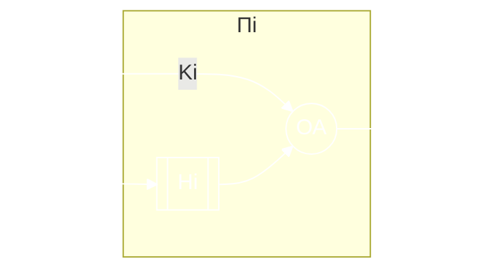

# Вычислительная система как объект моделирования

## Уровни проектирования

1. Структурный.
2. Функционально-логический уровень:
    - подуровни регистровых передач,
    - логический уровень.
3. Схемотехнический уровень.
4. Конструкторский.

## Моделирование на системном уровне

При моделировании новых и модернизации действующих вычислительных систем и сетей необходимо предварительно оценивать их возможности по функционированию с учетом различных вариантов структурной организации. Эти варианты могут отличаться составом и характеристиками модулей (наших устройств): структурами межмодульных связей, режимами работы и **алгоритмами управления**. *Именно для оценок и используются модели вычислительных систем*. 

Под **вычислительной системой** будем понимать комплекс аппаратных и программных средств, которые в совокупности выполняют определенные рабочие функции. 

**Коллектив пользователей** – это сообщество таких людей, которые используют нашу систему для удовлетворения нужд для обработки информации.

Входные сигналы (программы, данные, команды), которые создаются коллективом пользователей, называются *рабочей нагрузкой*.

**Операционная система** – набор ручных и автоматических процедур, которые позволяют группе людей эффективно использовать вычислительную установку.

**Индекс производительности** – описатель, который используется для представления производительности системы. Различают *количественные* и *качественные* индексы производительности.

1. Качественные:
    - легкость использования системы;
    - мощность системы команд.
2. Количественные:
    - пропускная способность – объем информации, обрабатываемый в единицу времени;
    - время ответа (реакции) – время между предъявлением системе входных данных и появлением соответствующей выходной информации;
    - коэффициент использования оборудования – отношение времени использования указанной части оборудования в течение заданного интервала времени к длительности этого интервала.

*Концептуальная модель* вычислительной системы включает сведение о выходных и конструктивных параметрах системы, её структуре, особенностях работы каждого элемента и ресурса, постановка прикладных задач, определение цели моделирования.

## Основные задачи

1. Определение принципов организации ВС.
2. Выбор архитектуры, уточнение функций ВС и их разделение на подфункции, реализация аппаратным и программным путем.
3. Разработка структурной схемы – определение состава устройств и способов их взаимодействий.
4. Определение требований к выходным параметрам устройств и формирования технического задания на разработку устройств для функционально-логического уровня проектирования.

## Непрерывно стохастические модели (Q-схемы)

Особенности непрерывно-стохастического подхода в дальнейшем рассматривается только на примере использования в качестве типовых математическим моделей системы массового обслуживания. При этом исследуемая система формализуется как некоторая система обслуживания. Характерным для таких объектов является **случайное появление заявок на обслуживание и завершение обслуживания в случайные моменты времени**.

В любом элементарном акте обслуживании можно выделить ожидание обслуживания и собственно обслуживание.

Два типа потоков:

- поток-накопитель – характеризуется своей емкостью;
- поток обслуживания.

**Поток событий** – последовательность событий, происходящих одно за другим в какие-то случайные моменты времени. Поток событий называется однородным, если он характеризуется только моментами поступления этих событий (вызывающие моменты). Поток называется неоднородным, если он задается не только вызывающими моментами, но и признаками этих событий. Если интервалы времени между сообщениями независимы между собой и являются случайными величинами, то это поток с ограниченным действием.

***Поток событий называется ординарным***, если вероятность того, что на малый интервал времени $\Delta t$ попадает более одного события, пренебрежительно мала по сравнению с вероятностью того, что на этот же интервал времени $\Delta t$ попадает ровно одно событие.

***Поток называется стационарным***, если вероятность появления того или иного события на некотором интервале времени зависит лишь от длины этого интервала и не зависит от того, где на оси времени взят этот интервал.

Для ординарного потока среднее число событий. поступающих за малый интервал $\Delta t$:

$$
\large
P_{>1}(t, \Delta t) + P_1(t,\Delta t) = P_1(t, \Delta t) \\
\lim_{\alpha \to 0} {P_1(t, \Delta t) \over \Delta t } = \lambda_t
$$

Для стационарного потока его интенсивность не зависит от времени и представляет собой постоянное значение, равное среднему числу событий, поступивших в единицу времени.