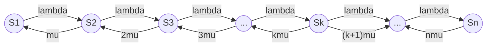
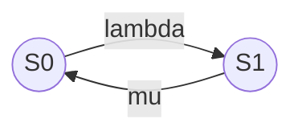
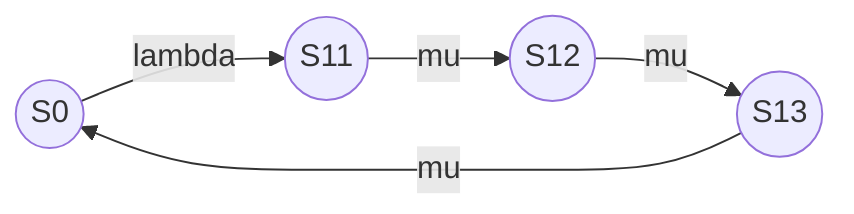

# Лекция 9

Разметим граф, то есть расставим стрелки интенсивности соответствующих потоков. По стрелкам слева направо системы переводит один и тот же поток, это поток заявок с интенсивностью $\lambda$. Пусть система была в состоянии S1 и тогда как только закончится обслуживание заявки занимающего этот канал, система перейдет в состояние S0, интенсивность перехода m. Если занято 2 канала, а не один, то интенсивность перехода составит $2\mu$.

$$
\begin{cases}
p_0'(t) = -\lambda p_0 + \mu p_1 \\
p_1'(t) = -(\lambda + \mu) p_1 + \lambda p_0 + 2 \mu p_2 \\
p_2'(t) = -(\lambda + 2\mu) p_2 + \lambda p_1 - 3\mu \\
... \\
p_k'(t) = -(\lambda + k\mu) p_k + \lambda p
\end{cases}
$$

Предельные вероятности состояний p0 и pn характеризую установившийся режим работы системы массового обслуживания при $t\to\infin$.

$$
p_0=\frac{1}{1+\frac{\lambda/\mu}{1!} + \frac{(\lambda/\mu)^2}{2!}+ \dots +\frac{(\lambda/\mu)^n}{n!}}\\
p_k= \frac{(\lambda/\mu)^k}{k!}p_0 \\
p_0=\Big[1+\frac{\rho}{1!}+\frac{\rho^2}{2!}+\frac{\rho^2}{2!}\Big]\\
p_k=\frac{p^k}{k!}p_0
$$

$\lambda/\mu$ - среднее число заявок, приходящих в систему за среднее время обслуживания одной заявки.

Зная все вероятности состояний $p_0 , … , p_n$ , можно найти характеристики СМО:

- вероятность отказа – вероятность того, что все n каналов заняты: $\large{p_{1OE}=p_n=\frac{\rho^n}{n!}p^0}$

* относительная пропускная способность – вероятность того, что заявка будет принята к обслуживанию:
  $ q=1-p_n$
* среднее число заявок, обслуженных в единицу времени: $A=\lambda q$

Полученные выражения могут рассматриваться как базисная модель оценки характеристик производительности систем. Входящий в эту модель параметр $\large \lambda = \frac{1}{\text{время обработки}}$ является усредненной характеристикой пользователей, а параметр $\mu$ – это функция технических характеристик компьютера, не только их, но еще и решаемых задач. Связь между ними должна быть установлена с помощью интерфейсной модели.

В простейшем случае, когда время ввода / вывода информации по каждой задачи мало по сравнению с временем ее решения, то можно принять, что $\large \text{время решения} = \frac{1}{\mu}$, где время решения – среднее время решения задачи процессом. Оно равно дроби, в числителе которой будет равно среднее число операций, выполняемых процессом на одну задачу.

## Немарковские случайные процессы, сводящиеся к марковским

Реальные процессы весьма часто обладают последействием и поэтому не являются марковскими. Очень редко удается воспользоваться методами, разработанными для марковских цепей. Наиболее распространённые:

- метод разложения случайного процесса на фазы (метод псевдосостояния);
- метод вложенных цепей Маркова.

### Метод псевдосостояния

Сущность метода заключается в том, что состояние системы, потоки переходов из которых являются немарковскими, заменяются эквивалентной группой фиктивных состояний, потоки переходов из которых являются марковскими.

Условия статистической эквивалентности реального состояния и фиктивных в каждом конкретном случае подбираются индивидуально. Очень часто может использоваться следующее: $\min \int_{t_1}^{t_2}{\Big(\lambda_{экв}(\tau)-\lambda_i(\tau)\Big)dt}$, где $\lambda$ – эквивалентная интенсивность перехода в $i$-ой группе переходов, заменяющей реальный переход, обладающий интенсивностью $\lambda_i$.

За счет расширения числа состояний системы некоторые процессы удается точно свести к марковским. Созданная таким образом система статистически эквивалентна или будет близка к реальной системе, и она подвергается обычному исследованию с помощью аппарата марковских цепей. 

К числу процессов, которые введением фиктивных состояний можно точно свести к марковских, относятся процессы под воздействием потоков Эрланга. В случае потока Эрланга k-ого порядка интервал времени между соседними событиями представляет собой сумму k независимых случайных интервалов, распределенных по показательному закону. Поэтому переход потока Эрланга k-го порядка к пуассоновскому осуществляется введением k псевдосостояний. Интенсивности переходов между псевдосостояниями равны соответствующему параметру потока Эрланга. Полученный таким образом эквивалентный случайный процесс является марковским, так как интервалы времени нахождения его в различных состояниях подчиняются показательному закону.

*Пример.* Устройство S выходит из строя с интенсивностью $\lambda$, причем поток отказов пуассоновский. После отказа устройство восстанавливается и время восстановления распределено по закону Эрланга 3 порядка с функцией плотности $f_2(t)=0.5\mu(\mu t)^2 e^{-\mu t}$.

Система может принимать два возможных состояния:

- $S_0$ – устройство исправно;
- $S_1$ – устройство отказало и восстанавливается.

Переход из $S_0$ в $S_1$ осуществляется под воздействием пуассоновского потока, а обратный - потока Эрланга.

Представим случайное время восстановления в виде суммы 3х случайных временных интервалов, распределенных по показательному закону с интенсивностью $\mu$.

$$
\begin{cases}
p'_0 = 0 = -\lambda p_0 + \mu p_{13} \\
p'_{11} = 0 = -\lambda p_{11} + \mu p_{0} \\
p'_{12} = 0 = -\lambda p_{12} + \mu p_{11} \\
p'_{13} = 0 = -\lambda p_{13} + \mu p_{12} \\
p_0 + p_1 = 1 \\
p_1 = p_{11} + p_{12} + p_{13}
\end{cases}
$$

$$
p_{13}=\frac{\lambda}{\mu}p_0 \\
p_{11}=\frac{\lambda}{\mu}p_0 \\
p_{12}=\frac{\lambda}{\mu}p_0 \\
p_1=\frac{3\lambda}{\mu}p_0 \\
p_0 + \frac{3 \lambda}{\mu}p_0 = 1 \to p_0 = \frac{\mu}{\mu+3\lambda} \\
p_1=\frac{3\lambda}{\mu+3\lambda} \\
\\
\text{Ответ: }P_0=\frac{\mu}{\mu+3\lambda}, P_1 = \frac{3}{3+\frac{\mu}{\lambda}}
$$

### Метод вложенных цепей Маркова.
Вложенные цепи Маркова образуются следующим образом: в исходном случайном процессе выбираются такие случайные процессы, в которых характеристики образуют марковскую цепь. Моменты времени обычно являются случайными и зависят от свойств исходного процесса. Затем обычными методами теории марковских цепей исследуются процессы только в эти характерные моменты. Случайный процесс называется полумарковским (с конечным или счетным множеством состояний) если заданы переходы состояний из одного состояния в другое и распределение времени пребывания процессов в каждом состоянии. Например, в виде функции распределения или функции плотности распределения.

### Метод статистических испытаний. Метод Монте-Карло.
**Преимущество** метода статистических испытаний: его универсальность, обуславливающая его возможность всестороннего статистического исследования объекта. Но для реализации этого исследования необходимы довольно полные статистические сведения о параметрах элемента входящих в системы.

 **Недостаток**: большой объем требующихся вычислений, равный количеству обращений к модели. Поэтому вопрос выбора величины n имеет важнейшее значение. Уменьшая n, повышаем экономичность расчетов, но одновременно ухудшаем их точность.
