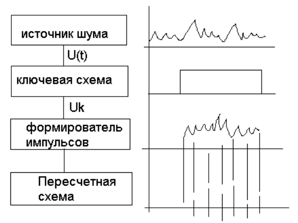

# Лекция 10

## Методы получения последовательности случайных чисел.

При имитационном моделировании сложных систем одним из основных вопросов является учет стохастических воздействий. Для этого метода характерно большое число операций со случайными числами и зависимость результатов от качества исходных последовательностей случайных чисел. Способы получения случайных:
1. Аппаратный (физический).
2. Табличный (файловый).
3. Алгоритмический (программный)


### Аппаратный способ.
Случайные числа вырабатываются специальной электронной приставкой (генератор случайных чисел - внешнее устройство).




### Табличная схема.

Случайные числа оформляются в виде таблицы и помещаются во внешнюю или оперативную память.


### Алгоритмический способ.
Способ основан на формировании случайных чисел с помощью специальных алгоритмов.


## Преимущества и недостатки методов генерации случайных чисел

|     Способ      | Достоинства                                                  | Недостатки                                                   |
| :-------------: | :----------------------------------------------------------- | :----------------------------------------------------------- |
|   Аппаратный    | 1. Запас чисел неограничен<br>2. Расходуется мало операций<br>3. Не занимается место в<br>оперативной памяти. | 1. Требуется периодическая<br>проверка на случайность<br>2. Нельзя воспроизводить<br>последовательности<br>3. Используются специальные<br>устройства. Надо стабилизировать |
|    Табличный    | 1. Требуется однократная<br>проверка<br>2. Можно воспроизводить<br>последовательности | 1. Запас чисел ограничен<br>2. Занимает место в оперативной<br/>памяти и требуется время на<br>обращение к памяти |
| Алгоритмический | 1. Однократная проверка<br>2. Можно многократно<br>воспроизводить<br>последовательности чисел<br>3. Относительно малое<br>место в оперативной памяти<br>4. Не используются внешние<br>устройства | 1. Запас чисел последовательности<br>ограничен её периодом<br>2. Требуются затраты машинного<br>времени |

Рассмотрим некоторую случайную величину $X$, которая может принимать любые значения из интервала $[a, b]$ и имеет плотность распределения $f_X(x) = \large \frac{1}{b-a}$.


## Алгоритмы генерации последовательности псевдослучайных чисел

Одним из первых способов получения последовательности псевдослучайных чисел было выделение дробной части многочлена первой степени: $y_n=Ent(an+b)$

Если n пробегает значения натурального ряда чисел, то поведение $y_n$ выглядит весьма хаотично. Физик Якоби доказал, что при рациональном коэффициенте $a$ множество $y$ конечно, а при иррациональном – бесконечно и всюду плотно в интервале [0, 1]. 

Для многочленов больших степеней такую задачу решил Герман Вей, он предложил критерий равномерности распределения любой функции от натурального ряда чисел. Называется это эргодичностью и заключается в том, что среднее по реализациям псевдослучайных чисел равно среднему по всему их множеству с вероятностью 1. Эти результаты далеки от практики получения последовательностей псевдослучайных чисел, поэтому она используется только для действительных чисел, что затрудняет практическую её реализацию. Попытки замены настоящего иррационального числа его приближением на компьютере привели к тому, что полученные последовательности оканчиваются циклом с коротким периодом.

1. **1946 год, Фон Нейман**.

   Каждое последующее число образуется возведением предыдущего в квадрат и отбрасыванием цифр. Способ с точки зрения случайности оказался нестабильным.

2. **Лимер**.

   $g_{n+1}=g_nk+c \mod m$

   Для подбора коэффициентов k, c, m потрачены десятки лет. Подбор почти иррациональных k ничего не дает. Разумнее вести все вычисления в целых числах. Установили, что при c = 0 и $m=2^n$ наибольший период достигается при нечетном начальном числе и при k = 3 + 8i, k = 5 + 8i.

3. **Форсайд**

   В 1977 году показал, что тройки последовательности чисел лежат на 15 параллельных плоскостях. 

```pascal
var n, i: integer;
	x, R: double;
	Const m34: double = 28395423107.0;
			 m35: double = 34359738368.0;
			 m36: double = 68719476736.0;
			 m37: double = 137438953472.0;
				 
function Rand(n: integer): double;
var S, W: double;
  i: integer;
begin
	if n = 0 then
	begin
		x := m34; Rand := 0; exit;
	end;
	S := -2.5;
	for i := 1 to 5 do
	begin
		x := 5.0 * x;
		if x > m37 then x := x - m37;
		if x > m36 then x := x - m36;
		if x > m35 then x := x - m35;
		W := x / m35;
				
		if n = 1 then
		begin
			Rand := W; exit
		end;
		S := S + W;
	end;

	S := S * 1.54919
	Rand := ( sqr(S) - 3.0 ) * S * 0.01 +S;
end;

begin
	R := Rand(0)
	for i := 1 to 200 do
		writeln(Rand(2):18:10)
end;
```

От отчаяния используют 2 и даже 3 разных генератора, смешивая их значения. Если бы разные генераторы были независимыми, то сумма их последовательностей обладала дисперсией, равной сумме дисперсией. Иначе случайность рядов возрастет при суммировании. Сейчас в системах программирования обычно используют конгруэнтные генераторы по алгоритму, предложенному национальным бюро стандартов США, который имеет длину $2^{24}$.

4. **Генерация случайных чисел по алгоритму Зеймана**.

{1, 1, 2, 3, 5, 8, 13, 21, …}

mod 10

{1, 1, 2, 3, 5, 8, 3, 1, …}

Переименовываем с помощью какого-либо ГСЧ; пусть всё так и осталось:

{1, 1, 2, 3, 5, 8, 3, 1, …}

В основе построения программы, генерирующей случайные числа с законом распределения отличным от равномерного лежит метод преобразования последовательности случайных чисел с равномерным законом распределения в последовательность случайных чисел с заданным законом.

$$
\tag{1} F(t)=\int_{-\infin}^{t} f(x)dx=R
$$

Метод основан на утверждении, что случайная величина $x$, принимающая значения, равные корню уравнения (1), имеет плотность распределения $f(x)$. $R$ – равномерная случайная величина от 0 до 1.

Значение случайной величины распределенной по показательному закону исходя из (1) может быть вычислено следующим образом: 

$1-e^{-\lambda X} = R$

$x = (-\frac{1}{\lambda})ln(1-R)$


### Распределение Пуассона

Распределение Пуассона относится к числу дискретных, то есть таких, при которых переменная может принимать лишь целочисленные значения, включая норму с мат. ожиданием и дисперсией равной $\lambda > 0$.

Для генерации пуассоновских переменных можно использовать метод точек, в основе которого лежит генерируемое случайное значение $R_i$ , равномерно распределенное на [0, 1], до тех пор, пока не станет справедливым

$$
\Pi^{x}_{i=0}R_i\ge e^{-\lambda}>\Pi^{x+1}_{i=0}R_i
$$

При получении случайной величины, функция распределения которой не позволяет найти решение уравнения (1) в явной форме можно произвести кусочно-линейную аппроксимацию, а затем вычислять приближенное значение корня. Кроме того, при получении случайных величин часто используют те или иные свойства распределения.


### Распределение Эрланга
Распределение Эрланга характеризуется двумя параметрами: $\lambda$ и k. Поэтому при вычислении случайной величины в соответствии с данным законом воспользуемся тем, что поток Эрланга может быть получен прореживанием потока Пуассона k раз. Поэтому достаточно получить k значений случайной величины распределенной по показательному закону и усреднить их.

$$
x = \frac{1}{k}(\sum^k_{i=1}(-\frac{1}{\lambda}ln(1-R_i))=-\frac{1}{k\lambda}\sum^k_{i=1}ln(1-R_i))
$$

### Нормальное (Гауссово) распределение
Нормально распределенная случайная величина может быть получена как сумма большого числа случайных величин, распределенных по одному и тому же закону и с одними и теми же параметрами. 

Случайная величина X имеющая нормальное распределение с математическим ожиданием $M_X$ и среднеквадратичным отклонением $\sigma_X$ может быть получена по следующей формуле:

$$
x=\sigma_X \cdot \sqrt{\frac{12}{N}} \cdot \Big(\sum^N_{i=1}R_i - \frac{N}{2}\Big) + M_X
$$

Для сокращения вычислений по нормальному закону распределения на практике часто принимают N = 12. Что дает довольно точные результаты.
