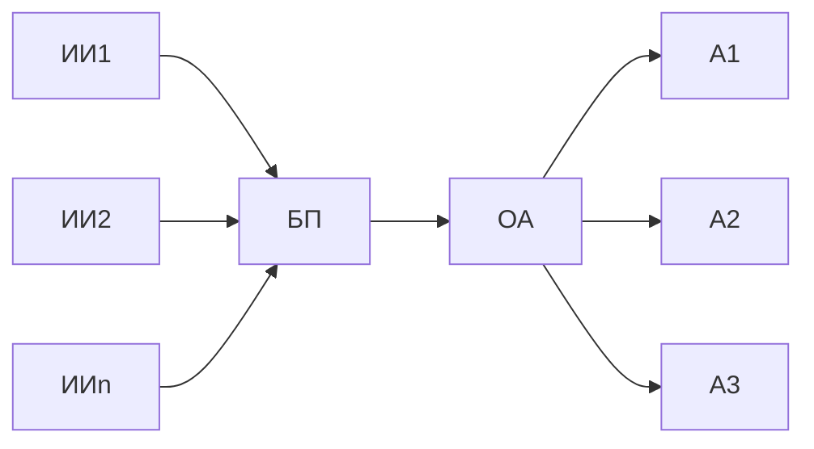
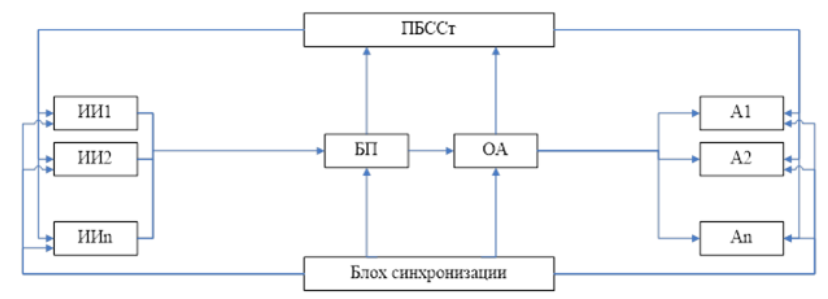
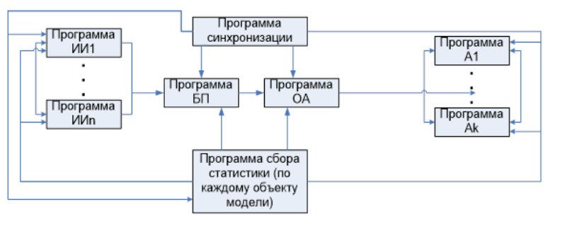
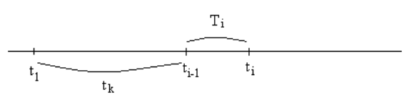
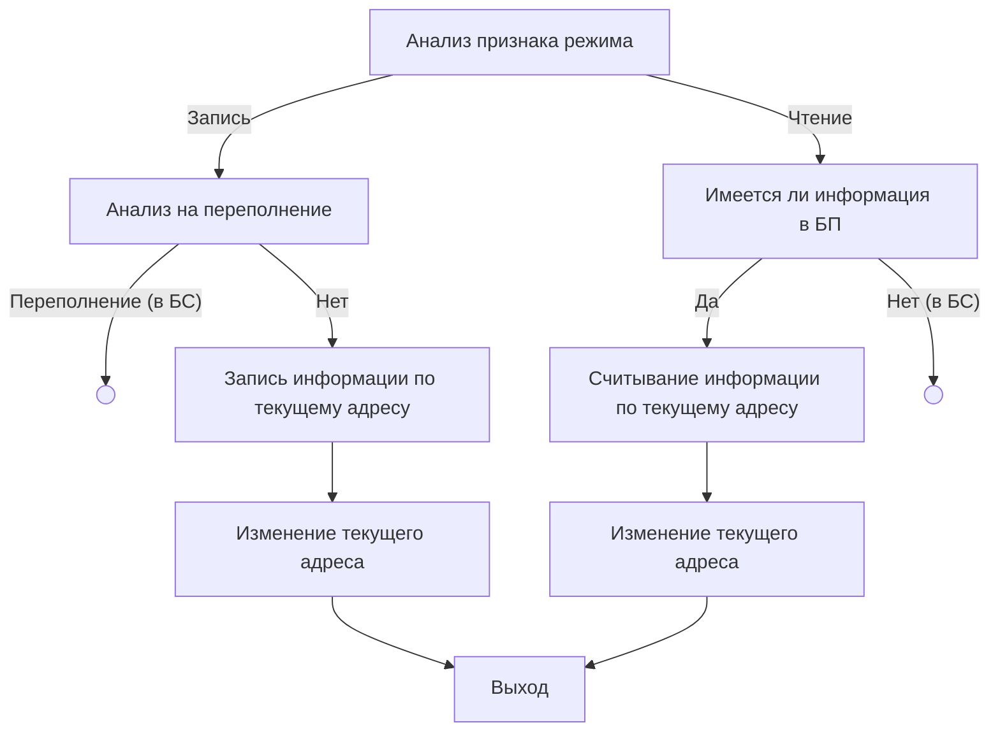
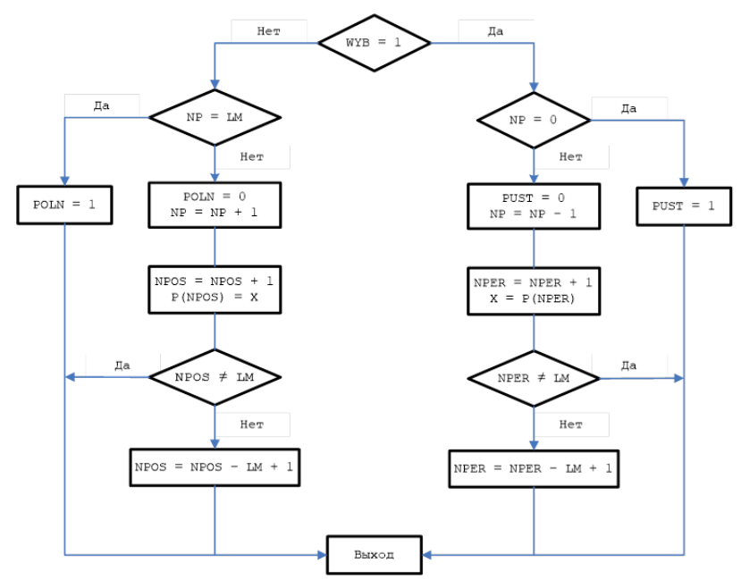

# Лекция 11. Методика построения имитационной программной модели вычислительной системы

Для разработки имитационной модели исходная система должна быть представлена как **стохастическая система массового обслуживания**. 

Информация от внешней среды поступает в случайные моменты времени. Длительность обработки различных типов информации может быть в общем случае различна. Следовательно, внешняя среда является как бы генератором сообщений, а комплекс вычислительных средств – обслуживающими устройством.

## Обобщенная структурная схема ВС.

- **ИИ** (источники информации) – выдают на вход буферной памяти (БП) независимые друг от друга сообщения. Закон появления сообщений – произвольный, но задан наперед. 
- В **БП** (буферной памяти) сообщения записываются «внавал» и выбираются по одному в обслуживающий аппарат (**ОА**) по принципу FIFO/LIFO. Длительность обработки одного сообщения в ОА в общем случае так же может быть случайной, но закон обработки сообщений должен быть задан. Так как быстродействие ОА ограничено то на входе системы в БП возможно сложение данных ожидающих обработки.
- **А** – абоненты.

Программная модель из этой системы создается следующим образом:

- Должна быть обязательно программа сбора статистики (ПБССт – программный блок сбора статистики). Причем статистику программа должна собирать по каждому из объектов модели. 
- Также должна быть программа, которая позволит "оживить" систему – это программа синхронизации (блок синхронизации), которая покажет когда и в какое время будут активизированы те или иные фрагменты модели. Программа синхронизации – управляющая программа (осуществляет связь между каждым из этих блоков).

Если описать каждый блок ВС с помощью программного имитатора и задать соответствующие связи между ними, то получаем имитационную или программную модель системы.

## Моделирование потока сообщений

Поток сообщений обычно имитируется ***моментами появления очередного сообщения в потоке***. Момент текущего времени вычисляется как:

$$
t_k=\sum_{k=1}^{i-1}T_k + T_i
$$

|        Тип распределения        |                          Выражение                           |
| :-----------------------------: | :----------------------------------------------------------: |
| Равномерное на отрезке $[a, b]$ |               $t_k=\sum_{k=1}^{i-1}T_k + T_i$                |
|        Экспоненциальное         |               $T_i=-\frac{1}{\lambda}ln(1-R)$                |
|    Нормальное (Гауссовское)     | $T_i = \sigma_X\sqrt{\frac{12}{n}}(\sum^n_{i=1}R_i-\frac{n}{2}) + M_X, n=12$ |
|             Эрланга             |       $T_i=\frac{1}{k \lambda} \sum^k_{i=1}ln(1-R_i)$        |

## Моделирование работы обслуживающего аппарата

Программа, имитирующая работу обслуживающего аппарата – это набор программ, вырабатывающих случайные отрезки времени, соответствующие длительностью обслуживания требованиям.

Например, если требования от источника обрабатываются в ОА по нормальному закону с параметрами $M_X$ и $\sigma_X,$ то длительность обработки $i$-ого требования:

$$
T_{\text{обр}}=M_X+(\sum^{12}_{i=1}R_i-6) \cdot \sigma_X
$$

**Схема алгоритма имитатора**:

$R_i$ – случайное число с равномерным законом распределения;

$Т_{\text{обр}}$ – время обработки очередного сообщения;

$T$ – время освобождения ОА;

$MX$ – мат. ожидание для заданного закона обратки;

$DX$ – СКО (средне квадратичное отклонение) для заданного закона обратоки.

 $T_{\text{обр}}=MX+(S-6) \cdot DX$

## Моделирование работы абонента

Абонент может рассматриваться как ОА, поток информации на который поступает от процессора.
Для имитации работы абонентов необходимо составить программу выработки длительности обслуживания требования. Кроме того, абонент сам может быть источником заявок вообще на любые ресурсы вычислительной системы. Эти заявки могут имитироваться с помощью генератора сообщений, распределенными по заданному закону. Таким образом, абонент либо имитируется как ОА, либо как генератор.

## Моделирование работы буферной памяти

**Память** – относится к электромеханическому устройству, предназначенное для хранения, записи, считывания и включающее в себя среду для запоминания, устройство управления (информация находится по адресу база + смещение + [индекс]).

**Свойства памяти**: предназначена для хранения, чтения и записи информации.

В блок статистики: ошибки записи, ошибки чтения.

Блок памяти должен производить запись и считывание числа, выдавать сигнал переполнения и отсутствия данных в любой момент времени, располагать сведениями о количестве находящихся в ней (в блоке) заявок. Сама запоминающая среда в простейшем случае имитируется одномерным массивом, размер которого определяет ёмкость памяти. Каждый элемент этого массива может быть либо "свободен" и в этом случае мы считаем, что он равен 0, либо "занят", в этом случае в качестве эквивалента требования ему присваивается значение времени появления этой записи (заносим время обращения к памяти).

## Концептуальная модель памяти

## Алгоритм реализации работы буферной памяти

