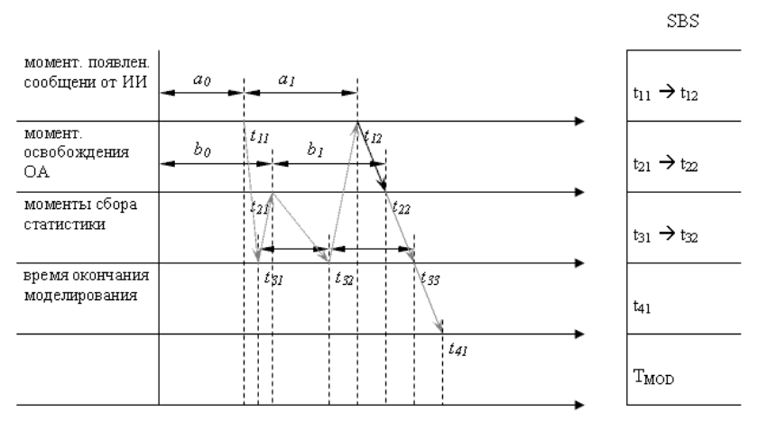
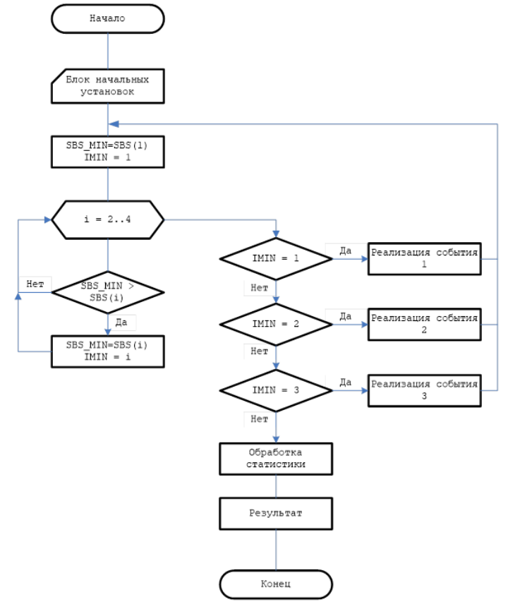

# Лекция 12

## Разработка программы для сбора статистики
Задача блока статистики заключается в накоплении численных значений, необходимых для вычисления статистических оценок, заданных параметров работы моделируемой системы. При моделировании простейшей модели СМО, наибольший интерес представляет, **среднее время ожидания в очереди**. Для каждого сообщения *время ожидания в очереди* равно разности между моментами времени когда оно было выбрано на обработку обслуживающим аппаратом и моментом времени, когда оно пришло в систему от источника информации.

Суммируя количество сообщений в блоке памяти через небольшие промежутки времени и разделив полученную сумму на число суммирований, получим *среднее значение длины очереди*.

**Коэффициент загрузки** обслуживающего аппарата (ОА) определяется как отношение времени работы ОА к общему времени моделирования.

Рассчитав число потерянных сообщений, можно определить *вероятность потери сообщений* в системе. Нужно разделить количество потерянных сообщений на сумму потерянных и обработанных сообщений в системе.

## Управляющая программа имитационной модели
Если программные имитаторы работы источника или буферной памяти обслуживающего аппарата отображают работу отдельных устройств, то управляющая программа имитирует алгоритм взаимодействия отдельных устройств системы. 

Управляющая программа реализуется по следующим принципам:
1.	Принцип $\Delta t$.
2.	Событийный принцип.

### Принцип $\Delta t$
Принцип $\Delta t$ заключается в последовательном анализе состояний всех блоков в момент $t + \Delta t$ по заданному состоянию блоков в момент $t$. При этом новое состояние блоков определяется в соответствии с их алгоритмическим описанием с учетом действующих случайных факторов, задаваемых распределениями вероятности. В результате такого анализа принимается решение о том, какие общесистемные события должны имитироваться программной моделью на данный момент времени.

Основной **недостаток** этого принципа: значительные затраты машинного времени на реализацию моделирования системы. А при недостаточно малом $\Delta t$ появляется опасность пропуска отдельных событий в системе, что исключает возможность получения адекватных результатов при моделировании. 

**Достоинство**: равномерная протяжка времени.

### Событийный принцип.
Характерным свойством моделируемых систем обработки информации является то, что состояние отдельных устройств изменяются в дискретные моменты времени, совпадающие с моментами времени поступления сообщений в систему, временем поступления / окончания задачи, времени поступления аварийных сигналов и т.д. Следовательно, моделирование и продвижение времени в системе удобно проводить, используя событийный принцип. При использовании данного принципа состояние всех блоков имитационной модели анализируется лишь в момент появления какого-либо события. Момент наступления следующего события определяется минимальным значением из списка будущих событий, представляющего собой совокупность моментов ближайшего изменения состояния каждого из блоков системы.

**Недостаток** событийного принципа: самостоятельная обработка.

## Схема событийного принципа

- Первая ось: момент появления сообщений.
- Вторая ось: момент освобождения обслуживающего аппарата.
- Третья ось: момент сбора статистики (здесь абсолютно равные интервалы, мы сами определяем, когда собирать статистику).
- Четвертая ось: время окончания моделирования.
- Пятая ось: текущее время.
- $t_{11}$, $t_{12}$ – моменты появления сообщений на выходе генератора (источника информации).
- $b_1$ – интервал времени обслуживания первого сообщения.
- $t_{3n}$ – момент сбора статистики.
- $t_{41}$ – момент окончания моделирования.
- SBS – список будущих событий.

## Методика реализации событийной модели

1. Для всех активных блоков (порождающих события) заводят свой элемент в одномерном массиве – в списке будущих событий (СБС).
2. В качестве подготовительной операции в СБС заносят время ближайшего события от любого активного блока. Активизируя программный имитатор источника событий, вырабатывают псевдослучайную величину $a_0,$ определяющую момент появления первого сообщения $t_{11}$ от источника информации и эту величину заносят в СБС. Активизируя программу-имитатор, ОА вырабатывает псевдослучайную величину $b_0$, определяющую момент времени $t_{21}$, которую также заносят в СБС. В момент времени $t_{31}$ (момент первого сбора статистики) определяется равным стандартному шагу сбору статистики $t_{\text{СТАТ}}$ и заносится так же в СБС. В этот же список заносим время окончания моделирования $t_{41}$. На этом подготовительный этап заканчивается и далее протяжка времени осуществляется по следующему алгоритму:

1. В SBS определяется минимальное числовое значение и его номер.
2. Реализуется событие, порождаемое блоком с соответствующим номером, то есть модельное время = $t_{11}$. Далее реализуется событие с номером 1, связанное с появлением нового сообщения в ИИ. Реализация этого события заключается в том, что само сообщение записывается в память, а с помощью имитатора ИИ, вырабатывается момент появления следующего события $t_{12}$. Это время помещается в соответствующую ячейку SBS вместо $t_{11}$.
3. Затем вновь организуется поиск минимального элемента в SBS. Для данного примера реализуется событие 3, после чего выражение момента времени $t_{32}$ – новое время сбора статистики. Так до тех пор, пока минимальное время не станет равным $t_{41}$.

## Комбинированный метод

Два приведенных метода являются универсальными алгоритмами протяжки модального времени. Причем для некоторых предметных областей один принцип может работать быстро и без потерь, а другой будет работать неэффективно. Выбор метода необходимо производить исходя из распределения событий по времени. В реальных системах распределение событий, как правило, *неоднородно*. События, как бы группируются по времени. Образование таких групп связано с наступлением какого-то "значимого" события, которое начинает определенную последовательность действий с соответствующими событиями, имеющими высокую плотность на следующем временном интервале. Такой интервал называется **пиковым**. А распределение событий **квазисинхронным**. Примером может являться – цифровая сеть, в которой синхронизирующие сигналы переключают большое количество триггеров. Для сложных дискретных систем, в которых присутствуют квазисинхронное распределение событий, был разработан алгоритм с название **Delft**. Особенностью данного метода является автоматическая адаптация к распределению событий. Метод реализуется таким образом, что на пиковых интервалах он приближается к методу $\Delta t,$ а вне пиковых – к событийному. В основе лежит использование иерархической структуры циркулярных списков. 
