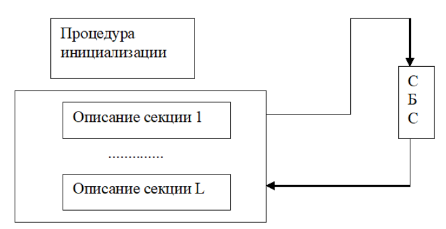

# Лекция 13

## Моделирование системы и языки моделирования

Алгоритмические языки при моделировании систем служат вспомогательным аппаратом в разработке машинной реализации и анализа характеристик моделей.

*Основная задача – это выбор языка.*

Каждый язык имеет свою систему абстракций, позволяющих реализовать формальную модель системы.

Качество языков моделирования характеризуется:
- удобством описания процесса функционирования;
- удобством ввода исходных данных, варьирования структуры, алгоритмов разработки и параметров модели;
- эффективностью анализа и вывода результатов моделирования;
- простотой отладки и контроля работы моделирующей программы;
- доступностью восприятия и использования языка.

Все современные языки программирования определяют поведение систем во времени (событийный алгоритм и его модификации). В большинстве своем языки моделирования определяют поведение систем во времени с помощью модифицированного событийного алгоритма. Как правило, он включает в себя список текущих и будущих событий.

## Классификация языков имитационного моделирования.
Основа классификации – принцип формирования системного времени. 

Непрерывное представление систем сводится к представлению дифференциальных уравнений, с помощью которых устанавливается связь вход-выход. Если выходные переменные модели принимают дискретные значения, то уравнения являются разностными.

Предполагается, что в системе могут наступать события двух типов:
* события, зависящие от состояния;
* события, зависящие от времени.

Состояние системы описывается набором переменных, причем некоторые из них меняются непрерывно. При таком подходе пользователь должен использовать функции, описывающие условия наступления событий. Обязательно нужно описать: законы изменения непрерывных переменных, правила перехода от одного состояния к другому, т.е. реализуется классический принцип ДУ (дифференциальные уравнения).

## Формальное описание динамики моделируемого объекта
Будем считать, что любая работа в системе совершается путем выполнения ***активностей***. Т.е. активность является наименьшей единицей работы. Именно её рассматривают как единый дискретный шаг. Она имеет свое время выполнения. Следовательно, активность является единым динамическим объектом, указывающим на совершение единицы работ.

**Процесс** – это логически связанный набор активностей.

*Пример (считывание информации с жесткого диска)*: активность установки головки жесткого диска, активность ожидания запроса к диску, активность передачи информации с жесткого диска.

Активность проявляется в результате совершения событий. **События** – это мгновенное изменение состояния некоторого объекта системы.

Рассмотренные объекты (активности, процессы, события) являются **конструктивными элементам** для динамического поведения системы. На их основе строятся языки моделирования. В то время, когда динамическое поведение системы формируется в результате выполнения большого числа взаимодействующих процессов, сами эти процессы образуют относительно небольшое число классов. Следовательно, чтобы описать поведение сложной системы, достаточно описать поведение каждого класса процессов и задать значение атрибутов для конкретных процессов (т.е. выбрать параметрическую модель).

## Задачи построения модели
Построение модели состоит из решения двух основных задач:
1.	Первая задача сводится к тому, чтобы описать правила, задающие виды процессов, происходящих в системе. Указать значения атрибутов таких процессов или сгенерировать. При этом система описывается на определенном уровне детализации в терминах множества описаний процессов, каждый из которых включает множество правил и условий возбуждения активности. Такое описание системы может быть декомпозировано. Именно такой подход обеспечивает многоуровневое исследование системы. 
1.	Вторая задача заключается в том, чтобы описать правила задания атрибутов или задать правила генерации этих значений. При этом система определяется на конкретном уровне детализации в терминах множества описаний процессов, каждый из которых в свою очередь включает множество правил и условий возбуждений активности. Такое описание системы может быть детализировано на более подробном или более иерархическом уровне представления с помощью декомпозиции процессов (в идеальном случае в активности). Это обеспечивает многоуровневое исследование системы.

Так как модель в общем случае служит для описания временного поведения системы, то язык моделирования должен обладать средствами отображения времени.

## Языки, ориентированные на события

Моделирующая программа реализована в виде совокупности секций событий. Секция событий состоит из операций, которые в общем случае выполняются после завершения какой-либо активности. Выполнение функций синхронизировано списков будущих событий.

**Структура программы на языке SIMSCRIPT**:

Первичное описание – это описание секций событий.

## Языки, ориентированные на процессы

Моделирующая программа организуется в виде набора описаний процесса. Каждый из которых описывает один класс. Описание процесса функционирования устанавливает атрибуты и активности всех процессов. Синхронизация операций во времени (языка ориентированного на процессы) реализуются так же с помощью списка будущих событий, который содержит точку возобновления конкретного процесса (точка прерывания).

**На примере языка SIMULA**:

## Критерии

- возможности языка (SIMULA $\to$ SIMSCRIPT $\to$ GPSS $\to$ C $\to$ Python)
- простота применения (GPSS $\to$ SIMSCRIPT $\to$ SIMULA $\to$ Python $\to$ C)
- предпочтения пользователя (SIMSCRIPT $\to$ GPSS $\to$ SIMULA $\to$ Python $\to$ C)

## Сравнение универсальных и специализированных языков программирования при моделировании

