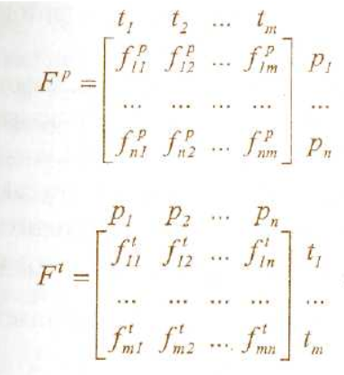
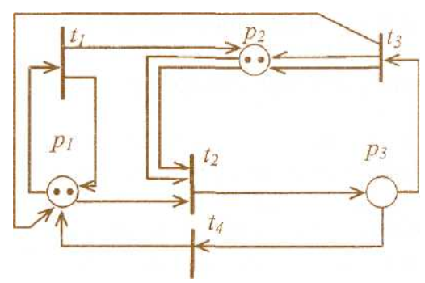
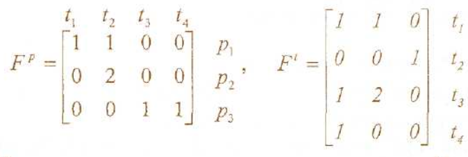
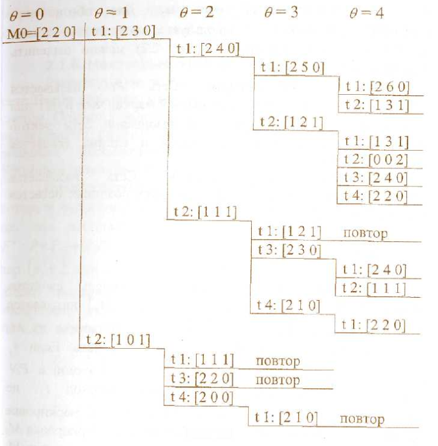

# Лекция 14. Обыкновенные сети Петри

## Формальное определение
***Сеть Петри*** – это математическая модель дискретных динамических систем (параллельных программ, операционных систем, ЭВМ и их устройств, сетей ЭВМ), ориентированная на качественный анализ и синтез таких систем (обнаружение блокировок, тупиковых ситуаций и узких мест, автоматический синтез параллельных программ и компонентов ЭВМ и др.)

Определение сети Петри – формально в терминах теории систем это кортеж (т.е. набор элементов)

$PN = \{\Theta,P,T,F,M_0\}.$

В этом определении: 

- $\Theta = \{\theta = 0,1,2,...\}$ – множество дискретных моментов времени; 
- $P = \{p_1,p_2,...,p_n\}$ – непустое множество элементов сети, называемых ***позициями*** (местами);
- $T = \{t_1,t_2,...,t_m\}$ – непустое множество элементов сети, называемых **переходами**;

​	Множества позиций и переходов не пересекаются: $P \cap T = \emptyset$.

- F – **функция инцидентности**;

​	$F: (P \times T) \cup (T \times P) \to \{0,1,2,...,k,...\},$ где $k$ – кратность дугиж

- $M_0$ - *начальная маркировка* позиций: $М_0 : Р \to \{0,1,2,...\}$.

Функция инцидентности  может быть представлена в виде $F = F^p \cup F'$ и фактически задает два отображения:
1) $F^p(p,t) = P \times T \to \{0,1,2,...\},$ т.е. для каждой позиции указываются связанные с ней переходы (с учетом их кратности);
2) $F^t(t,p)- T \times P \to [0,1,2,...],$ т.е. для каждого перехода указываются связанные  с ним позиции  (также  с учетом кратности).

Эти функции, в общем случае зависящие от времени, могут быть представлены *матрицами инцидентности*: 

Из вершины-позиции $p_i \in P$ ведет дуга в вершину-переход $t_j \in T$ тогда и только тогда, когда $F_{ij}^p > 0$. В этом случае говорят что $t_j$ – выходной переход позиции $p_i$.

Множество всех позиций $p_k$ для которых $t_j$ является выходным переходом, будем обозначать $P^j: \{p_k,f_{ij}>0\}.$ Иными словами, $P^j=\{p_k:f^t_{li}>0\}.$

Аналогично из каждый вершины перехода $t_j \in T$ дуга ведёт в вершину-позицию
$p_i \in P$ , тогда и только тогда, когда $f^t_{ji}>0.$ При этом говорят что $p_i$ является выходной позицией перехода $t_j$.

Множество всех переходов $t_l,$ для которых для которых $p_i$ – выходная позиция, будем обозначать $T^i.$ Таким образом, $T^i=\{t_l:f^t_{li}>0\}.$ При $f^p_{ij}>0$ и $f^t_{ji}>0$ эти величины называются кратностью соответствующих дуг.

Каждая позиция $p_i \in Р$ может содержать некоторый целочисленный ресурс $\mu(р)\ge0$, часто отображаемый соответствующим числом точек (фишек) внутри позиции. Этим ресурсом могут быть студенты (число фишек = число студентов), сданные работы (число фишек = число сданных работ) и т.п. Вектор $М = \{\mu_1,\mu_2,...,\mu_k\}$ **называют разметкой (маркировкой) сети Петри**. Каждая маркировка – это отображение $M:P\to \{0,1,2,...\}.$ Начальная маркировка $M_0$ определяет стартовое состояние сети Петри.

Динамика поведения моделируемой системы описывается, в отличие от конечных автоматов, в терминах функционирования сетей Петри. Как было сказано, сеть функционирует в дискретном времени $\tau=0, 1, 2, 3, ...$ в асинхронном режиме, переходя от разметки к разметке.

**Смена разметок** (начиная с $M_0$) происходит в результате срабатывания переходов сети. Переход $t_j \in T$ может сработать при разметке $М$, если для всех $p_i \in P_j $ выполняется условие $\mu_i(\theta)-f_{ij}^p(\theta) \ge 0$, т.е. если каждая входная позиция для данного перехода $p_i \in P_j$ содержит как минимум столько фишек, какова кратность дуги ведущей к $t_j$ переходу в момент времен $\theta$.

В результате срабатывания перехода $t_j$ в момент времени $\theta$ разметка $M(\theta)$ сменяется разметкой $M(\theta+1)$ по правилу:

$\mu_i(\theta+1)=\mu_i(\theta)-f_{ij}^P(\theta)+f_{ji}^{\tau}(\theta)$

Иными словами, переход $t$ изымает из каждой своей входной позиции число фишек, равное кратности входных дуг, и посылает в каждую свою выходную позицию число фишек, равное кратности выходных дуг.

Если может сработать несколько переходов, то срабатывает один, любой из них. Функционирование сети останавливается, если при некоторой маркировке *(тупиковая маркировка)* ни один из ее переходов не может сработать. При одной и той же начальной маркировке сеть Петри может порождать, в силу недетерминированности ее функционирования, различные последовательности срабатывания ее переходов. Эти последовательности образуют *слова в алфавите Т*.

Множество всевозможных слов, порождаемых сетью Петри, называют *языком сети Петри*. Две сети Петри эквивалентны, если порождают один и тот же язык.

В отличие от конечных автоматов, в терминах которых описываются глобальные состояния систем, сети Петри концентрируют внимание на локальных событиях (переходах), локальных условиях (позициях) и локальных связях между событиями и условиями. Поэтому в терминах сетей Петри более адекватно, чем с помощью автоматов, моделируется поведение распределенных асинхронных систем.

## Графы сетей Петри

Формальное определение сети Петри, изложенное выше, полностью определяет ее функционирование. Однако при решении конкретных инженерных задач удобнее и нагляднее графическое представление этих сетей.

Поэтому ниже функционирование сетей Петри изложено две позиции теории графов. Теоретико-графовым представлением сети Петри является двудольный ориентированный мультиграф данной сети. Этот граф содержит:

-	позиции (места), обозначаемые кружками;
-	переходы, обозначаются вертикальными планками;
-	ориентированные дуги (стрелки), соединяющие позиции
с переходами и переходы  позициями. Кратные дуги обозначаются несколькими параллельными дугами.

Благодаря наличию кратных дуг сеть Петри есть мультиграф. Благодаря двум типам вершин граф называется двудольным. Поскольку дуги имеют направление, граф является ориентированным. Пример такого мультиграфа показан на рисунке:

Для сети, изображенной на этом рисунке, матрицы инцидентности имеют вид:

Начальная маркировка, как видно из рисунка, $М_0 = [2,2,0]$. Очевидно, что матричное и графовое представления взаимно однозначно, соответствуют друг другу. В случае большой кратности дуг ее можно указывать цифрами на соответствующей дуге.

## Пространство состояний сети Петри

Состояние сети Петри определяется ее маркировкой. Пространство состояний сети Петри, обладающей $n$ позициями, есть множество всех маркировок, т.е. *Е"*. Изменение в состоянии, вызванное запуском перехода, определяется функцией перехода $S$ или функцией следующего состояния. Когда эта функция применяется к маркировке $М$ и переходу $t_j$ (если он разрешен), то в соответствии с нашим условием работы получается новая маркировка $М'=\delta(M,t_j)$. Она, как уже говорилось, получается изъятием, фишек из позиции $p_i$ таких, что $f_{ij}^p \ne 0$ $(\mu_i \ge f_{ij}^p)$ и помещением фишек в позиции $р_k$ такие, что $f^t_{lk} \ge 0$.

Процесс создания новых маркировок продолжается до тех пор, пока в сети Петри при данной маркировке существует хоть один разрешенный переход. Если же при некоторой маркировке $М(\tau)$ ни один переход не разрешен, то такая маркировка называется тупиковой.

При выполнении сети Петри получается две последовательности:
- последовательность маркировок $\{М(0),М(1),М(2),...\}$;
- последовательность запущенных переходов $\{t_{j0},t_{j1},t_{j2},…\}$.

Эти две последовательности связаны следующим соотношением:
$M(\theta+1)=\delta(M(\theta),t_{j\tau})$

Если в результате запуска перехода при маркировке $М$ образуется новая маркировка $М'$, то говорят, что $М'$ достижима из $М$. **Множество достижимости** $R(PN,M)$ сети Петри $PN$ c маркировкой $М$ есть множество всех $М_k$, достижимых из $М$.

**Запуск:**

