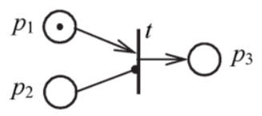
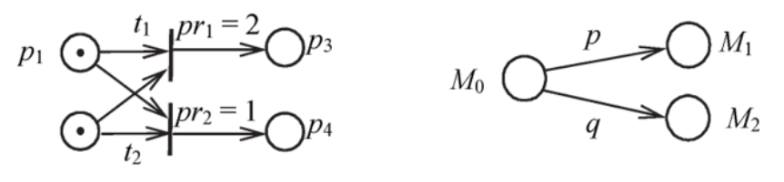
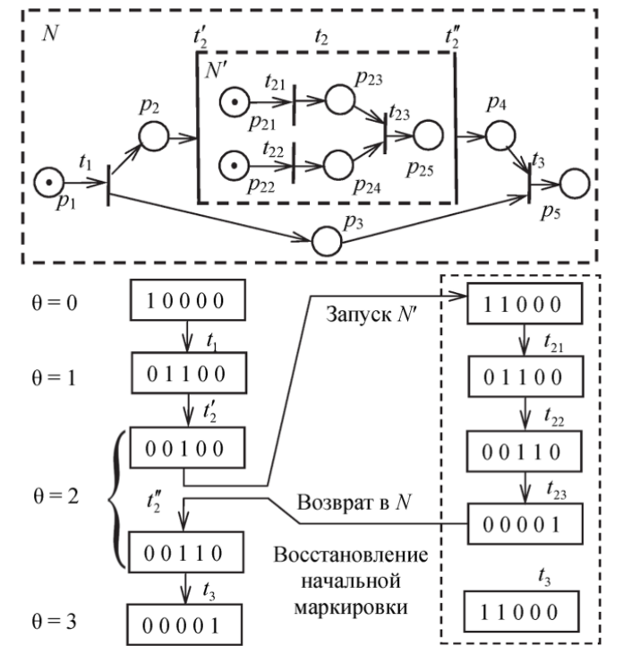
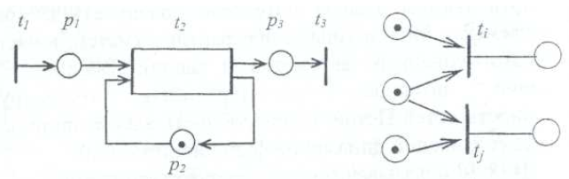
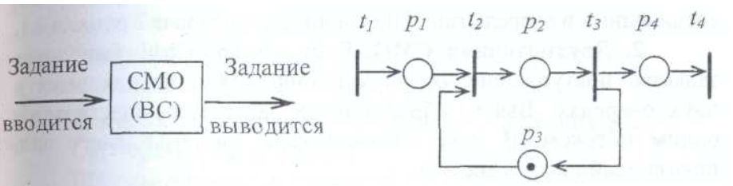
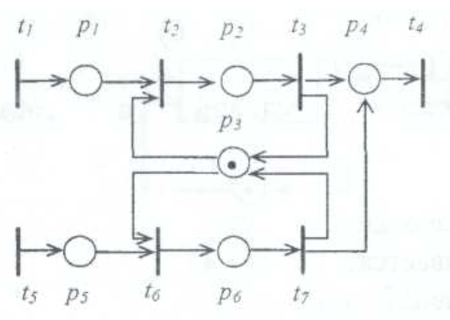

# Лекция 15

## Основные свойства сети Петри

1. Свойство ограниченности – позиция в сети называется ограниченной, если для любой достижимой в сети маркировки существует такое $k$, что маркировка $\mu \le k$, то есть сеть называется ограниченной, если все ее позиции ограниченные (сеть, которую мы рассматривали на предыдущем рисунке, неограниченная). 
2. Свойств безопасности – в безопасной сети вектор маркировок состоит только из нулей и единиц, то есть является двоичным
3. Свойство консервативности – сеть называется консервативной, если сумма фишек во всех позициях остается постоянной при работе с ней, то есть сумма по всем $\tau$ для данной сети остается постоянной.
4. Свойство живости – переход называется потенциально живым, если в начальной маркировки существует некая маркировка, при которой переход может сработать. Если переход является потенциально живым для любой достижимой в сети маркировки, то он называется живым. Если не является – то называем мертвым, маркировка в этом случае будет называться тупиковой. То есть при тупиковой маркировки не может сработать ни один переход. Переход называется *устойчивым*, если никакой другой переход не может лишить его возможности сработать при наличии необходимых условий.

## Ингибиторные сети

Это сети Петри, для которых функция инцидентности имеет вид $F^P$ т.е. она дополнена специальной функцией инцидентности

Ингибиторные дуги связывают только позиции с переходами, кратность этих дуг равна 1. Правила срабатывания перех.

Это сети Петри, для которых функция инцидентности имеет вид $F = F^P \cup F^t \cup F^I,$ т. е. она дополнена специальной функцией инцидентности $F^I: Р \times Т \to \{0, 1\}$, которая вводит ***ингибиторные дуги*** для тех пар $(p_i t_j)$, для которых $f^I_{ij} = 1$. Ингибиторные дуги связывают только позиции с переходами, эти дуги на рисунках заканчиваются не стрелками, а кружочками. Кратность этих дуг всегда равна 1.

Правила срабатывания переходов в ингибиторной сети модифицируются следующим образом: переход $t_j$ может сработать при маркировке М, если для всех связанных с ним позиций $p_i$ и $p_k$.

$$
(\mu_i \ge f_{ij}^p) \wedge (\mu_k \cdot f_{kj}^I=0),
$$

то есть введено дополнительное условие: позиция $p_k$, соединенная с переходом $t_j$ ингибиторной дугой, не должна содержать фишек (должна иметь нулевую маркировку). Так, переход $t$ на рисунке выше может срабатывать только при $\mu_1 > 0$ и $\mu_2 = 0$.

## Сети с приоритетами

При определении сети Петри отмечалась недетерминированность ее работы: если имеется возможность срабатывания нескольких переходов, то срабатывает любой из них. При моделировании реальных систем могут сложиться ситуации, когда последовательность срабатываний необходимо регламентировать. Это можно сделать, введя множество приоритетов $PR: Т \to \{0, 1, ...\}$ и приписав каждому из переходов $t_j$ соответствующее целочисленное значение приоритета $pr_j$. Тогда правило срабатывания переходов модифицируется: если на некотором такте работы сети $PN$ имеется возможность для срабатывания нескольких переходов, то срабатывает тот из них, который имеет наивысший приоритет. Так, из двух готовых к срабатыванию переходов $t_1$ и $t_2$ на рисунке первым должен сработать переход $t_2$, имеющий приоритет $pr_2 = 1$, поскольку приоритет перехода $t_1 рг_2 = 2$, то есть ниже.

## Сети со случайными срабатываниями переходов

В описанной выше ситуации, когда имеется возможность срабатывания нескольких переходов $t_i, t_j ..., t_s$, их приоритет можно задавать вероятностями срабатывания каждого их переходов $p_i, р_j, ..., p_s$, причем $p_i + p_j + ... + p_s = 1$. Тогда исходная маркировка $М_0$ приведет на следующих шагах работы сети к набору маркировок $M_i, M_j, ..., M_S$, каждая из которых будет помечена соответствующей вероятностью. Отождествив маркировки с состоянием сети и предположив, что вероятности не зависят от работы сети в предыдущие такты, мы получим цепь Маркова, описывающую вероятностное поведение системы.

## Иерархические сети

Сети представляют собой многоуровневые структуры, в которых выделяют сети различных уровней (позволяют моделировать различные многоуровневые иерархические системы).

В отличие от обыкновенных сетей Петри, в иерархических сетях имеются два типа переходов: простые и составные. Простые переходы ничем не отличаются от рассмотренных ранее. Составные переходы содержат внутри себя сеть Петри более низкого уровня. Формально они состоят из входного ("головного") и выходного ("хвостового") переходов, между ними находится внутрення сеть Петри, которая, в свою очередь, также может быть иерархической (вложенность не ограничена).

Пример иерархической сети N:

Здесь приведен пример иерархической сети который имеет составной переход $t_2$, содержащий внутри себя сеть $N'$ этот составной переход имеет голову ($t_2'$) и хвост ($t_2''$). Между ними заключена вся сеть. Она состоит из позиций $p_{21}, p_{25}$ и переходов $t_{21}, t_{23}$. Иерархическая сеть функционирует как обыкновенная сеть, переходя от одной маркировки к другой, обмениваясь фишками (в том числе между сетями различного уровня). Исключение составляют правила работы составных переходов.

Срабатывание составных переходов является не мгновенным событием, как в обыкновенных сетях Петри, а некоторым составным действием. Поэтому говорят не о срабатывании составного перехода, а о его работе. На каждом шаге дискретного времени $\theta$ составной переход может находиться в одном из двух состояний - пассивном и активном. Начальное состояние всех переходов - пассивное. Составной переход может быть активирован, в момент времени $\theta$, если до этого он был пассивен и имеются условия для срабатывания его головного перехода. При этом производится изменение маркировки в сети верхнего уровня по известным нам правилам и одновременно запускается работа в сети, находящейся внутри составного перехода. Во время ее работы функционирование сети верхнего уровня блокируется. Сеть нижнего уровня работает с учетом своей начальной маркировки до тех пор, пока все ее переходы не станут пассивными (то есть не смогут сработать). После этого происходит срабатывание хвостового перехода и изменение маркировки сети верхнего уровня. Составной переход возвращается в пассивное состояние, а в сети нижнего уровня восстанавливается начальная маркировка.

> На шаге $\theta = 2$ происходит работа составного перехода и сети $N'$ в следующем порядке: срабатывает $t_2'$, запуск сети $N'$, окончание работы $N'$, восстановление начальной маркировки, срабатывание $t_2$ и продолжение работы сети.

Описанный процесс напоминает выполнение подпрограммы при программировании, где срабатывание перехода $t'_2$ соответствует вызову подпрограммы, а $t''_2$ срабатывание - возврату в основную программу.

## Раскрашенные (цветные) сети
В ряде приложений перемещаемые в сети Петри ресурсы (фишки) требуется дифференцировать, и тогда приходится вводить фишки различных видов (например, разных цветов). В этом случае для каждого перехода необходимо указывать, при каких комбинациях фишек во входных позициях он может сработать и какое количество фишек различных цветов помещается в выходные позиции.

## Моделирование дискретных систем, формализованных сетей Петри
При описании сетей Петри выделяют два понятия: события и условия. 

**События** – это действие в системе. В сетях Петри они моделируются переходами.

**Условие** – предикат или логическое описание системы, принимающее значение "истина" или "ложь". Условия моделируются позициями и условиями на дугах. Различаются предусловия и постусловия.

**Предусловие** – это условие до срабатывания перехода, **постусловие** – соответственно, условие после срабатывания перехода.

Если процесс в системе достаточно сложный, то его подсистемы можно представить в виде **непримитивных событий**.

Особенность Сети Петри – **одновременность**. Если переходы $t_i$ и $t_j$ не влияют друг на друга, то в возможный словарь языка сети Петри входят как слова, начинающиеся с $t_i$ так и слова, начинающиеся с $t_j$.

Еще одна ситуация называется **конфликтом**. Переходы $t_i$, и $t_j$ находятся в конфликте, если запуск одного из них блокирует запуск другого.

## Простейшая система массового обслуживания.
Система имеет входной поток заданий (или заявок), и пока она занята выполнением очередного задания, она не может ввести следующее.

Рассмотрим множество условий и событий, характеризующих нашу СМО.

**Условия**:

- $P_1$ - задание ждет обработки;
- $Р_2$ - задание обрабатывается;
- $Р_3$ - процессор свободен;
- $Р_4$ - задание ожидает вывода.

 **События** (это действия):

- $t_1$ - задание помещается во входную очередь;
- $t_2$ - начало выполнения задания;
- $t_3$ - конец выполнения задания;
- $t_4$- задание выводится.

Поясним работу данной сети. Показанная на рисунке начальная маркировка $М_0 = [0,0,1,0]$ соответствует состоянию, когда система свободна и заявки на обслуживание отсутствуют. При срабатывании перехода $t_1$ (от внешнего источника) поступает задание и получается маркировка $М_1 = [1,0,1,0]$. При этом может сработать переход $t_2$, что означает начало обслуживания задания и приводит к маркировке $М_2 = [0,1,0,0]$. Затем может сработать переход $t_3$, что означает окончание обслуживания задания и освобождение системы, т.е. переход к маркировке $М_3 = [0,0,1,1]$. Переходы $t_1$ и $t_4$ могут работать независимо от $t_2$ и $t_3$, моделируя поступление и вывод заданий.

**Двухпоточная СМО.** Пусть теперь СМО выполняет задания, поступающие от двух источников и находящиеся в двух очередях. Вывод обработанных заданий осуществляется одним потоком.

Здесь введены дополнительные **условия**:

- $Р_5$ – задание из второй очереди ждет обработки;
- $Р_6$ - задание из второй очереди обрабатывается.

Также введены дополнительные **события**:

- $t_5$ - задание помещается во вторую очередь;
- $t_6$ - начало выполнения задания из второй очереди;
- $t_7$ - завершение выполнения задания из второй очереди.