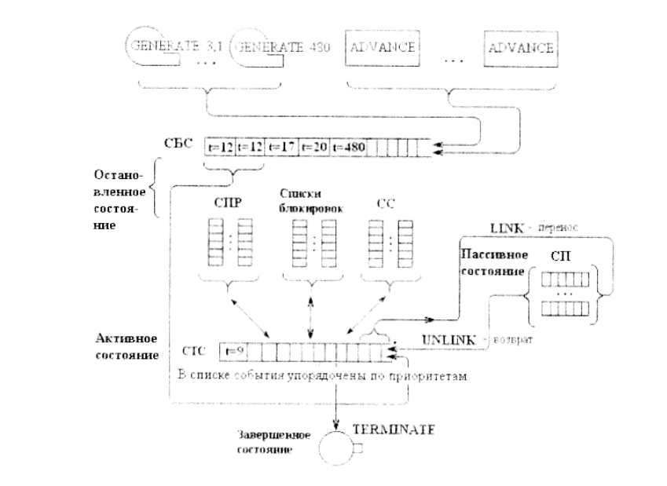

# Лекция 16. Язык General Purpose System Simulation (GPSS)

**Язык GPSS** – общецелевая система моделирования, предназначенная для того, чтобы выполнить анализ правильности функционирования любой системы с очередями. 

Система GPSS построена в предположении, что моделью сложной дискретной системы является описание ее элементов и логических правил их взаимодействия в процессе функционирования моделируемой системы. Для определенного класса моделируемых систем в GPSS можно выделить конечный набор абстрактных элементов, называемых **объектами**, причем набор логических правил также ограничен и может быть описан небольшим числом стандартных операций. Объекты языка подразделяются на 7 категорий и 14 типов. 

|   Категория    |           Типы           |
| :------------: | :----------------------: |
|  Динамическая  |        Транзакция        |
|  Операционная  |          Блоки           |
|   Аппаратная   | Устройства памяти, ключи |
| Вычислительная |   Переменные, функции    |
|  Статическая   |     Очереди, таблицы     |
|  Запоминающая  |  Ячейки, матрицы ячеек   |
|  Группирующая  |      Списки, группы      |

Моделирование заканчивается тогда, когда **счетчик завершений** (стандартный числовой атрибут), инициализированный оператором START будет равен 1. Или когда в списках СТС и СБС не будет ни одного транзакта. 