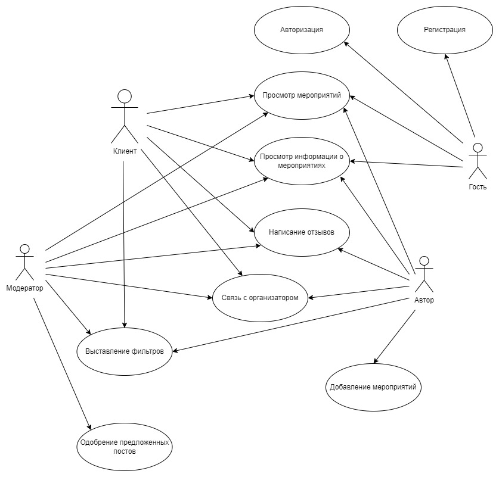
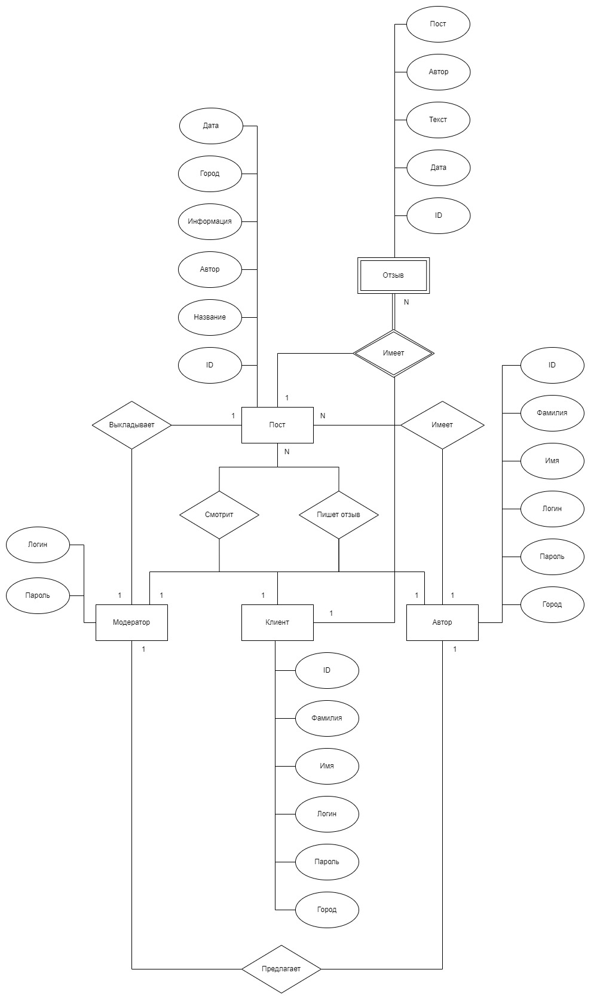
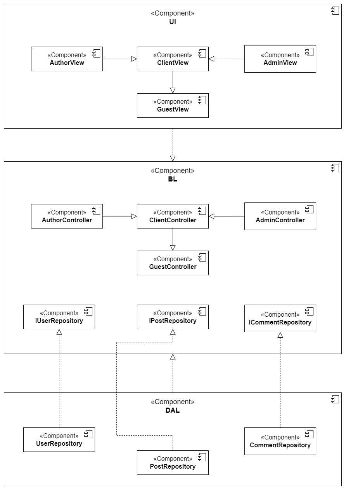
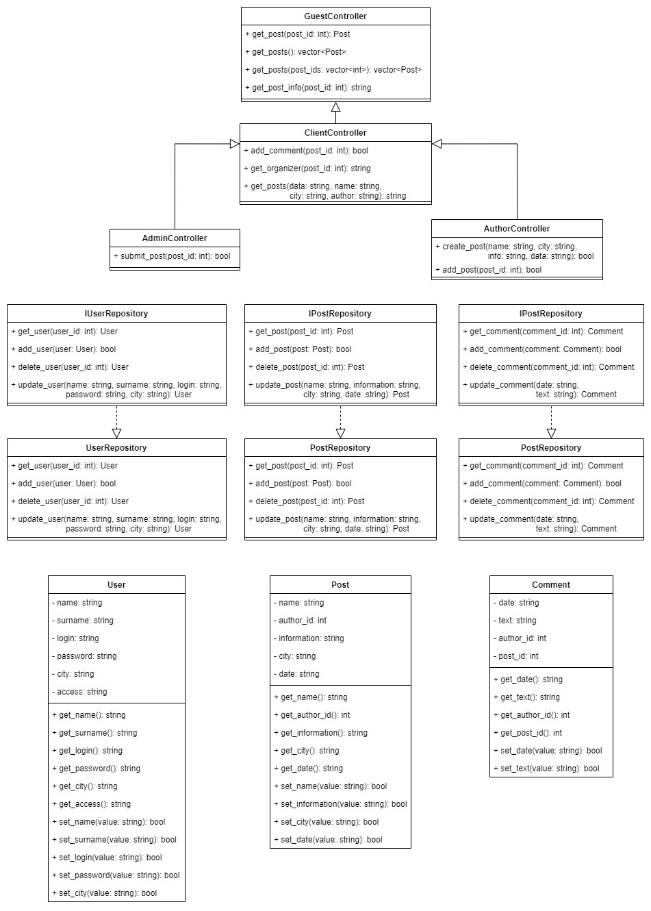
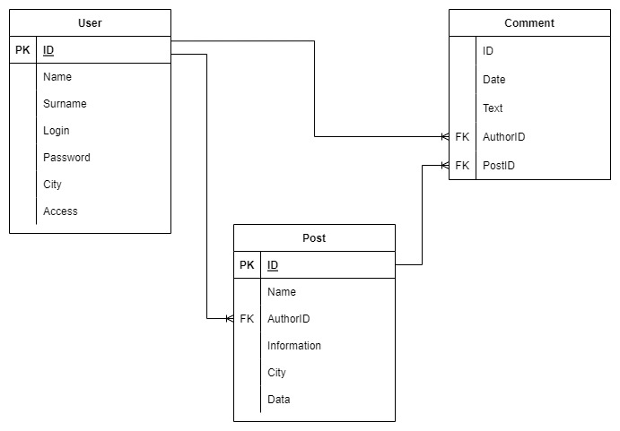
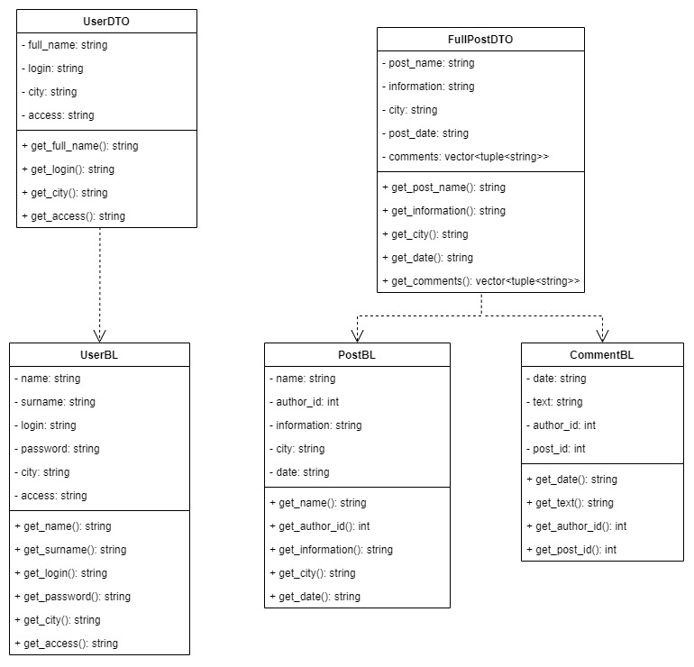
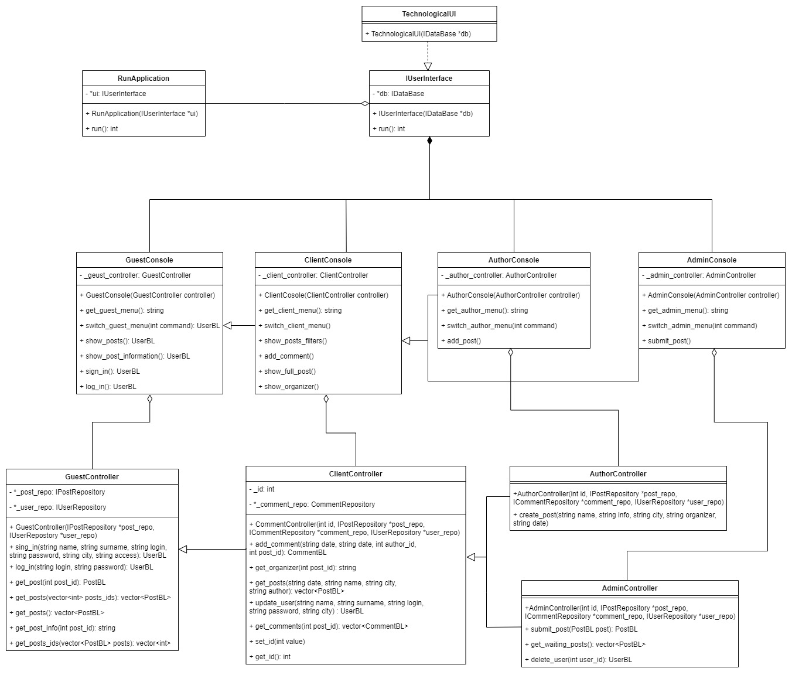
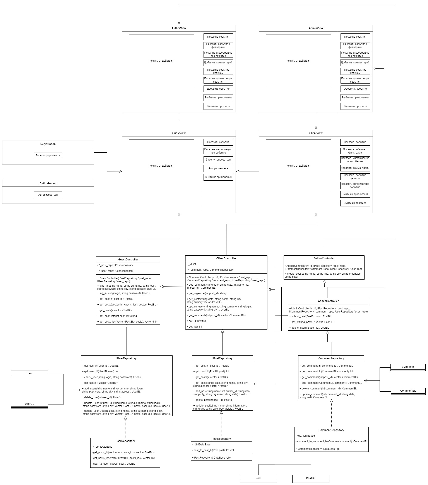

# Сервиc по поиску культурного досуга и развлечений в городе (LeisureAfisha)

## Краткое описание идеи проекта
Данный сервис предоставляет возможность пользователю находить информацию о различных событиях и мероприятиях (театральные представления, фильмы в кинотеатрах, выставки, концерты), которые проводятся в выбранном городе.

## Краткое описание предметной области
Предметной областью данного проекта являются мероприятия, проводимые в городе. В зависимости от вида пользователя (клиент или организатор мероприятий (в дальнейшем - автор)) имеется возможность:
- просмотра мероприятий;
- открытия информации о них;
- выставления фильтров;
- написания отзывов;
- связи со стороной, проводящей данное мероприятие;
- добавления новых мероприятий (в дальнейшем - постов).

## Краткий анализ аналогичных решений по 3 критериям
|    Название    |Фильтры|Отзывы|"Свободное" добавление мероприятий*|
|:--------------:|:-----:|:----:|:---------------------------------:|
|afisha.ru       |   +   |   -  |                -                  |
|afisha.yandex.ru|   +   |   +  |                -                  |
|kassir.ru       |   +   |   -  |                -                  |
|LeisureAfisha   |   +   |   +  |                +                  |

\* - автор может выкладывать посты, которые проходят проверку модератором
 
## Краткое обоснование целесообразности и актуальности проекта
В эпоху информационных технологий искать информацию стало гораздо легче, в том числе и про различные мероприятия. Однако зачастую приходится тратить время на поиск на различных сайтах. Разрабатываемый сервис предоставляет возможность просмотра данной информации в одном месте. При этом возможность добавления постов позволит каждому желающему пригласить людей на мероприятие.

## Use-Case - диаграмма

## ER-диаграмма сущностей

## Архитектурные характеристики, важные для проекта
Данный сервис является многопользовательским десктопным приложением.

Технологический стек: C++, PostgreSQL.

## Верхнеуровневое разбиение на компоненты

## UML диаграммы классов для двух отдельных компонентов

## Сущности базы данных

## Сущности системы и транспортные сущности

## Технологический UI и бизнес-логика

## UML-диаграмма для всего приложения
