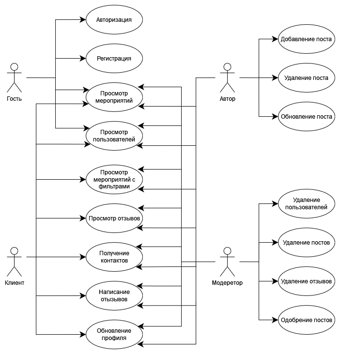
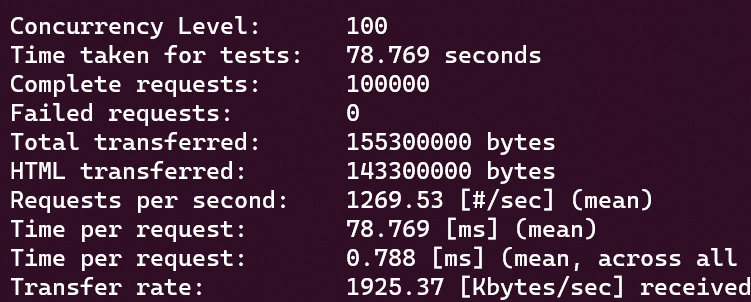

# Сервис по поиску культурного досуга и развлечений в городе (LeisureAfisha)

## Краткое описание идеи проекта
Данный сервис предоставляет возможность пользователю находить информацию о различных событиях и мероприятиях (театральные представления, фильмы в кинотеатрах, выставки, концерты), которые проводятся в выбранном городе.

## Краткое описание предметной области
Предметной областью данного проекта являются мероприятия, проводимые в городе. В зависимости от вида пользователя (клиент или организатор мероприятий (в дальнейшем - автор)) имеется возможность:
- просмотра мероприятий;
- открытия информации о них;
- выставления фильтров;
- написания отзывов;
- связи со стороной, проводящей данное мероприятие;
- добавления новых мероприятий (в дальнейшем - постов).

## Краткое обоснование целесообразности и актуальности проекта
В эпоху информационных технологий искать информацию стало гораздо легче, в том числе и про различные мероприятия. Однако зачастую приходится тратить время на поиск на различных сайтах. Разрабатываемый сервис предоставляет возможность просмотра данной информации в одном месте. При этом возможность добавления постов позволит каждому желающему пригласить людей на мероприятие.

## Use-Case - диаграмма

## Экраны будущего приложения

## ER-диаграмма сущностей

## Нагрузочное тестирование

|                Запрос                |          Без балансировки           |           С балансировкой           |
| :----------------------------------: | :---------------------------------: | :---------------------------------: |
|    ab -n 10 -c 1 localhost/api/v1    |  |  |
|   ab -n 100 -c 1 localhost/api/v1    |  |  |
|   ab -n 100 -c 10 localhost/api/v1   |  |  |
|   ab -n 1000 -c 1 localhost/api/v1   |  |  |
|  ab -n 1000 -c 10 localhost/api/v1   |  |  |
|  ab -n 1000 -c 100 localhost/api/v1  |  |  |
|  ab -n 10000 -c 1 localhost/api/v1   |  |  |
|  ab -n 10000 -c 10 localhost/api/v1  |  |  |
| ab -n 10000 -c 100 localhost/api/v1  |  |  |
|  ab -n 100000 -c 1 localhost/api/v1  |  |  |
| ab -n 100000 -c 10 localhost/api/v1  |  |  |
| ab -n 100000 -c 100 localhost/api/v1 |  |  |

Таким образом, видно, что при малом количестве запросов балансировка дает выигрыш в два раза, однако при их увеличении эта разница сокращается. Так, при 100000 запросах время обработки примерно одинаковое. Это может быть связано с тем, что так как все три сервера запущены на одной машине, то время может увеличиваться ввиду блокировок.
