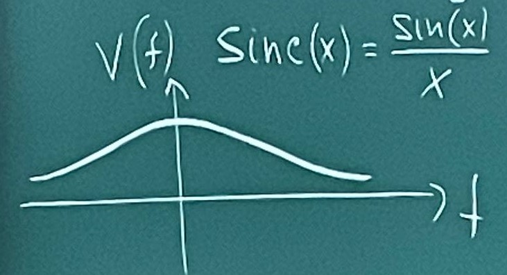
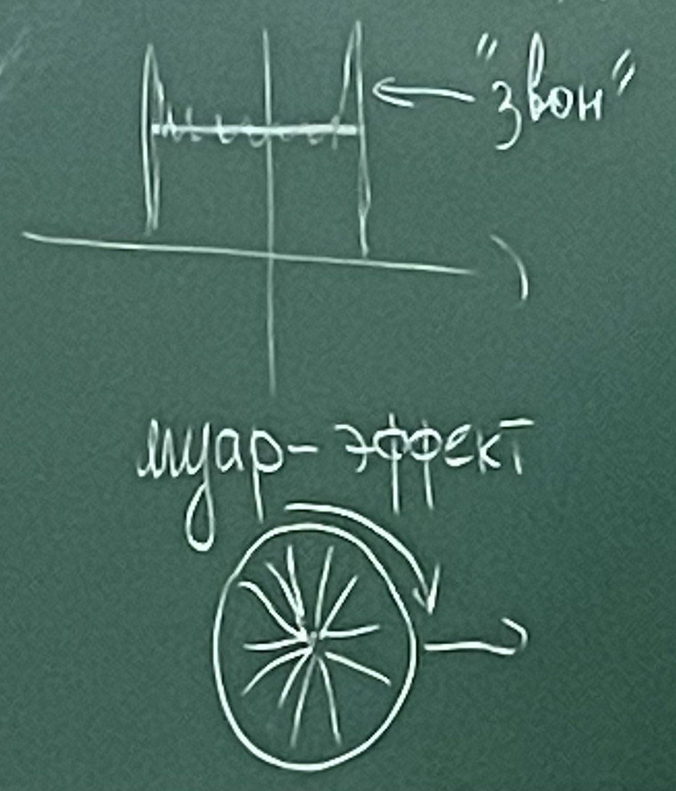
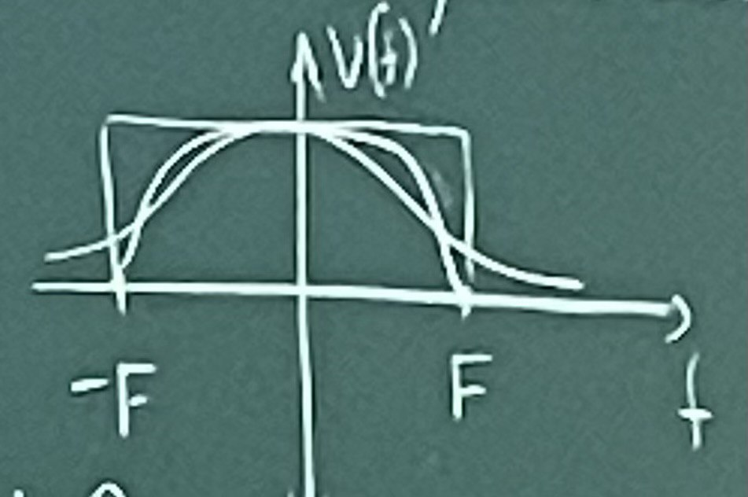
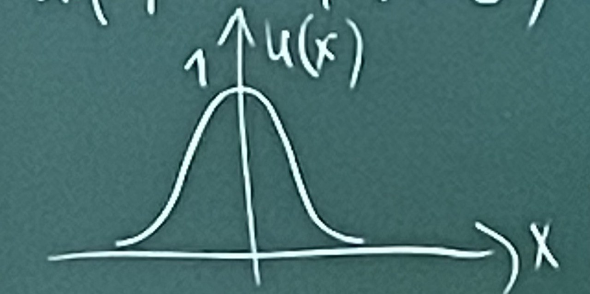
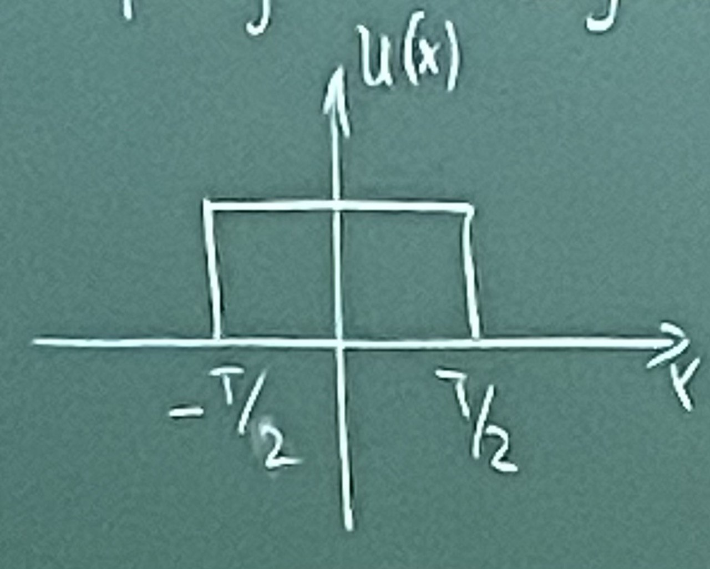
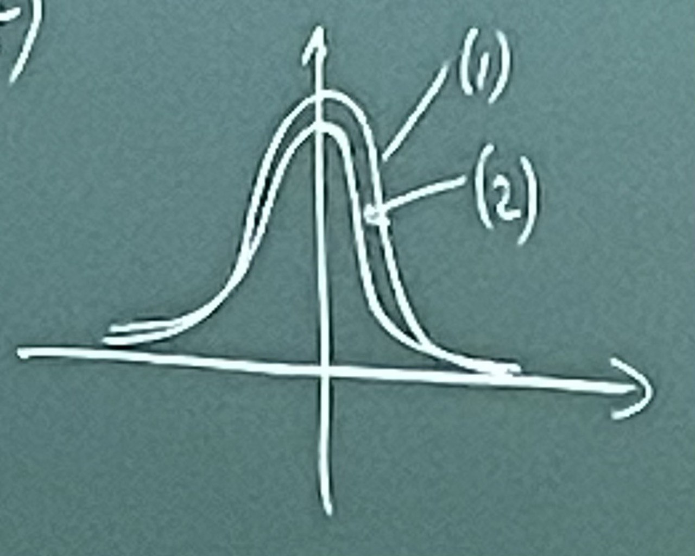
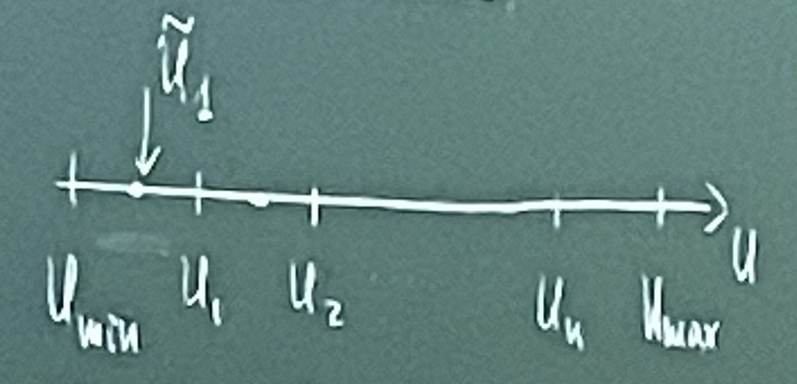
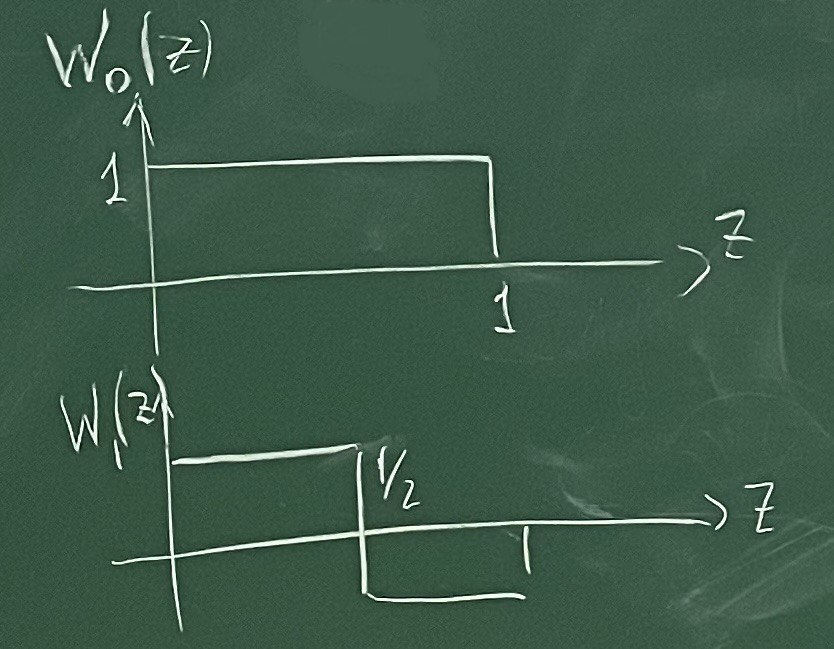

# Лекция 2

$(-F, F)$ $\Delta t = \frac{1}{2F}$ 

$U(t)=\sum_{k=\infty}^{+\infty}{U(k\Delta t )\text{sinc}(2\pi F(t-\frac{k}{2F}))}$

> $\text{sinc}(2\pi F(t-\frac{k}{2F}))$ – функция отсчетов

$\text{sinc}(x)=\frac{\sin{x}}{x}$

1. Нарушение частоты дискретизации

   $\Delta t \gt \frac{1}{2F}$ эффект Гиббса

   

   

2. Преодоление эффекта Гиббса

   - использование "окон"

   

   1. Окно Хеннинга

$$
w(t) = \begin{cases}
            \frac{1}{2}\Big(1+\cos({\frac{\pi f}{F}})\Big) & |f|\le F\\
            0 & \text{в остальных случаях}
            \end{cases}
$$

2. Окно Кайзера

$$
w(t)=\begin{cases}
            \frac{I_0\Big(\alpha \sqrt{1 - (\frac{f}{F})^2}\Big)}
            {I_0(\alpha)} & |f| \le F \\
            0 & \text{в остальных случаях}
            \end{cases}
$$

$I_0$ – модифицированная функция Бесселя

​      

## Лабораторная работа 1

Изучение дискретизации сигналов. Рассматриваем два типовых сигнала:

1. Сигнал Гаусса – $U(x)=\exp(\frac{-x^2}{\delta^2})$

   

   

2. Прямоугольный импульс (rect)

   

Выбираем шаг дискретизации и с этим шагом проводим дискретизации, то есть получаем набор отчета, а затем по формуле выполняем восстановление сигнала. Для сравнения будем строить в одних тех же осях две кривые: исходную и восстановленного сигнала. И смотрим насколько хорошо с заданным знаком произошло восстановление. 

Программа должна допускать изменение $\Delta t$. И то же самое для прямугольного импульса. То есть должны быть по итогу две картинки. И будем отвечать на вопросы, почему так получилось.

## Квантование сигналов

### Ошибка квантования

$\Epsilon_i=U-\widetilde{U}_i$

$D_0(\Epsilon_i)$ – функция ошибок 

**Ошибка**

$$
Q=\sum_{i=1}^{n-1}\int_{U_i}^{U_{i+1}}P(U)D_0(\Epsilon_i)du \to \min
$$

$P(U)$ – функция распределения

## Предискажение сигнала

$\hat{U}=\omega(U)$

**Ошибка**

$$
\Epsilon_i = \Delta_i - \text{ширина }\Delta_i = U_{i+1}-U_i\\
\Delta_i = \frac{\Delta p}{\omega'(U)} \\ 
Q = \sum_{i = 1}^{n - 1} \int_{U_i}^{U_{i+1}}{P(u)D_0\Big(\frac{\Delta p}{\omega'(U)}\Big)du}
$$

## Пороговая функция

$$
D(\Delta_i) = \begin{cases}
0 & |\Delta_i| \lt D_\text{нор}\\
1 & |\Delta_i| \ge D_\text{нор}
\end{cases}
$$

1. $D_\text{нор} = \text{const}$ – равномерное квантование.

2. Закон Вебера-Фехнера.

   $D_\text{нор} = \delta_0U$

$$
\frac{\omega(U)-\omega(U_\min)}{\omega(U_\max)-\omega(U_\min)}=
   \frac{\ln(\frac{U}{U_\min})}{\ln\frac{U_\max}{U_\min}}
$$

$N \approx230$

   $U \to \ln U \to \dots \to \exp(U)$ – потенцирование

   

## Спектральные преобразования сигналов

2. Преобразование Уолша [0, 1]

   а) Функция Уолша

$$
W_\alpha(z)=(-1)^{\sum_{k=1}^n \alpha_K Z_K} & 0\le Z\le 1\\
   Z = \sum_{k=1}^{n}Z_k2^{-k} & Z_k=0,1\\
   \alpha = \sum_{k=1}^n \alpha_k 2^{k-1} & \alpha_k=0,1
$$

$$
U(x) = \sum_{\alpha=0}^\infty C_\alpha W_\alpha(x)\\
C_\alpha = \int_0^1 U(x) W_\alpha(x)dx
$$

